## Introduction

Resource selection functions are powerful tools for predicting habitat selection of animals. Recently, machine-learning methods such as random forest have gained popularity for predicting habitat selection due to their flexibility and strong predictive performance.

We tested two methods for predicting continental-scale, second-order habitat selection of a wide-ranging large ungulate, the northern mountain caribou (*Rangifer tarandus caribou*), to support regional conservation management, including estimating abundance, and to predict habitat suitability for recolonizing or reintroduced animals.

## Methods

We compared a generalized linear model (GLM) and a random forest model using GPS location data from 25 individuals across the BC and Yukon and landscape data. We internally validated models and examined their ability to correctly classify used and available points by calculating area under the receiver operating characteristics (AUC). We performed leave-one-out (LOO) out-of-sample tests of predictive strength on both models.

Four seasons were defined using a range of dates (Appendix 1) based on discussions with regional biologists. 

## Results

### Model development

We develop RSF models for four seasons using GLM and Random Forest models.

Early winter

::: {.panel-tabset}

## GLM

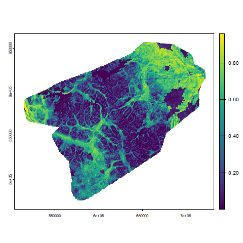

## Random forest

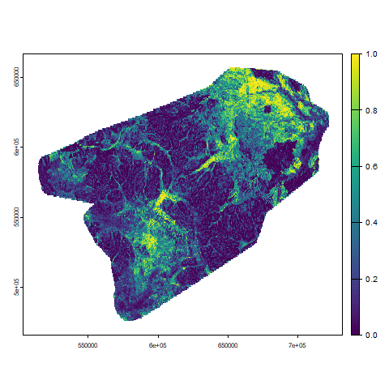

:::

Late winter

::: {.panel-tabset}

## GLM

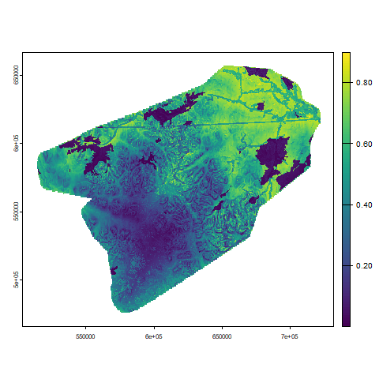

## Random forest

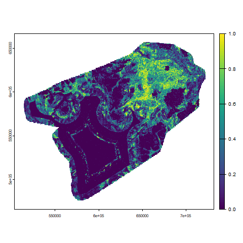

:::

Summer

::: {.panel-tabset}

## GLM

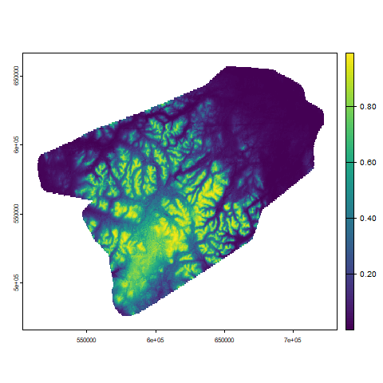

## Random forest

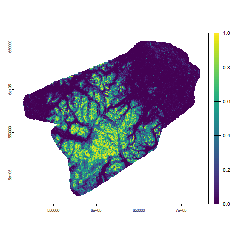

:::

Fall rut

::: {.panel-tabset}

## GLM

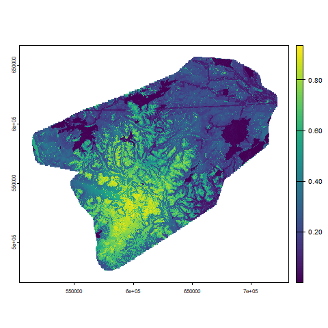

## Random forest

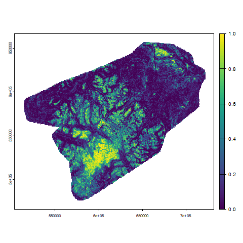

:::

### Model evaluation

**Early winter**

::: {.panel-tabset}

## GLM

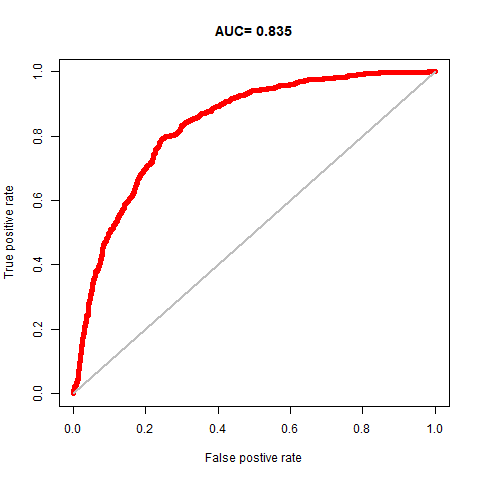

## Random forest

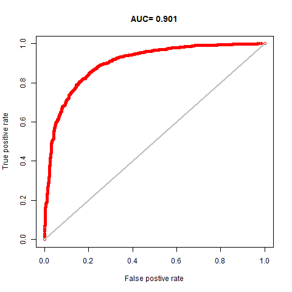

:::

**Late winter**

::: {.panel-tabset}

## GLM

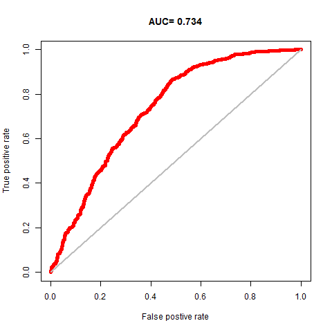

## Random forest

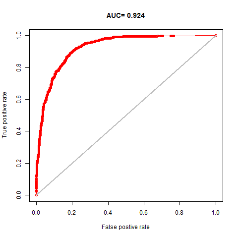

:::

**Summer**

::: {.panel-tabset}

## GLM

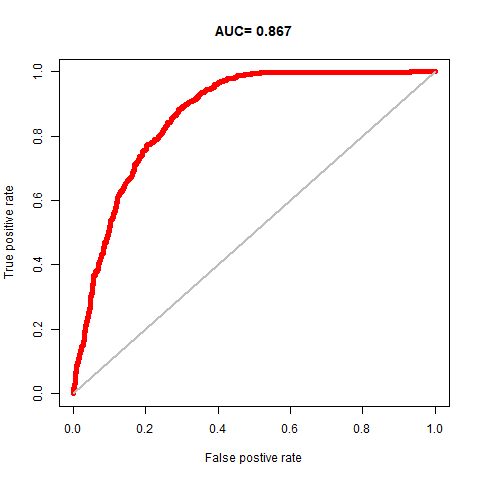

## Random forest

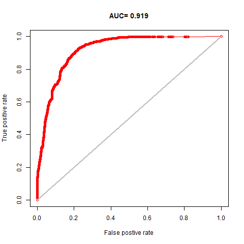

:::

**Fall rut**

::: {.panel-tabset}

## GLM

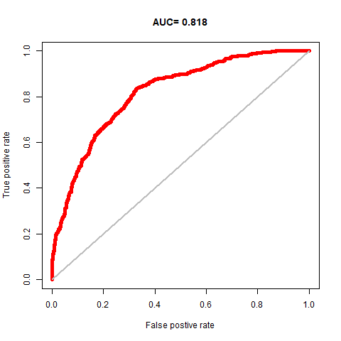

## Random forest

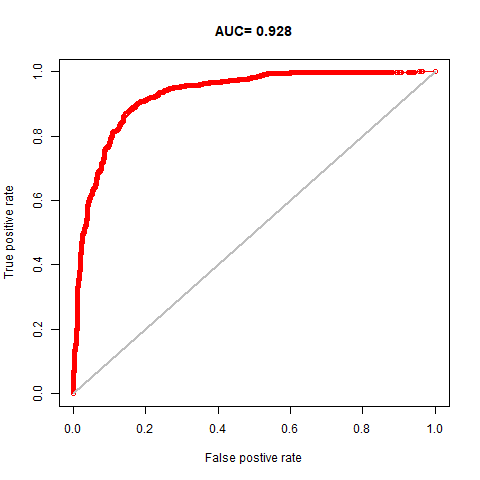

:::
