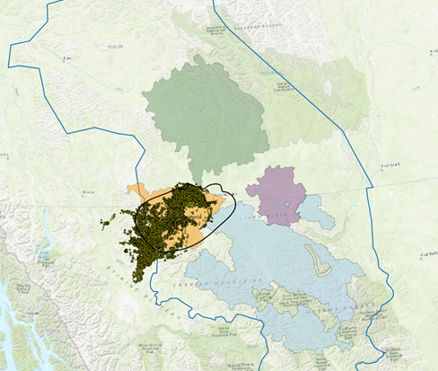
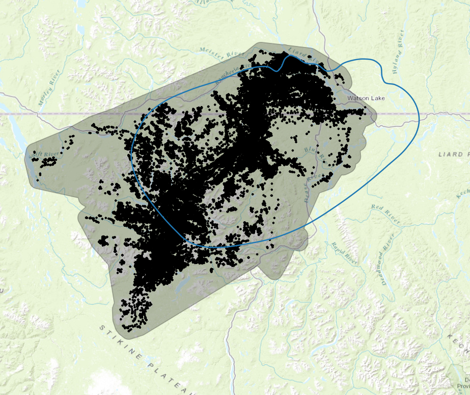
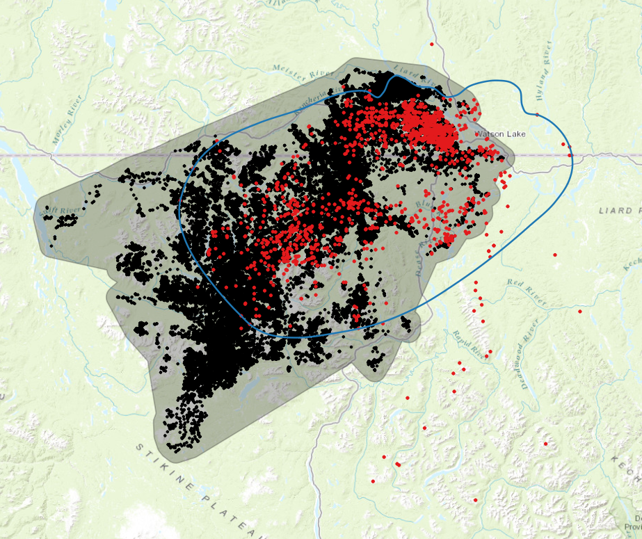

# Data preparation

## Area of interest

- Analysis region vs planning region
- Models are developed within analysis region (e.g., MCP) and used to predict within planning region - see QGIS project
- What is the appropriate planning region?

## Caribou locations

Outliers, thinning by pixel or distance

- Currently working with YT data - 25 individuals followed for 5 years (2020-2024); BC data is not as clean and does not include 2024 data; however, it does have older VHF locations, although without IDs
- Split the location data into 4 seasons: early winter, late winter, summer, fall rut. Based on Kelsey recommendations for Klaza/Clear Creek
- No evident spatial/temporal outliers with YT data

{width="49%"} {width="49%"}  Figure 1. Distribution of caribou locations obtained from Yukon government (left) and BC government (right). Caribou with a collar id are shown in red. The grey polygon represents the 100% MCP + 5km buffer for all collared caribou with at least 5 locations.

Data thinning prior to model building

- Caribou GPS data consist of a series of locations that are spatially and temporally correlated i.e., the locations are not independent of each other.
- Possible solutions:
  - Thin based on the cells of the raster i.e., retain one location per cell
  - Thin the dataset by distance (removing close-by points)
  - Combination of both approaches

## Seasonal ranges

- Definition of seasons: early- and late-winter, summer, fall rut

Seasonal date ranges for the Clear Creek herd and general seasonal dates for Northern Mountain Caribou (from Kelsey Russell).

| Season(1)            | Clear Creek Dates(2)     | NM caribou (3) |
| -------------------- | ------------------------ | ------------------------------------ |
| Winter               | Dec 06 - Apr 11          |                                      |
| Early Winter         |                          | Oct 21 - Jan 31                      |
| Late Winter          |                          | Feb 01 - Apr 15                      |
| Spring Migration     | Apr 12 - May 16          | Apr 16 - May 14                      |
| Calving/post calving | May 17 - Jun 16          | May 15 - Jun 15                      |
| Summer               | Jun 17 - Sep 17          | Jun 16 - Sep 14                      |
| Fall rut             | Sep 18 - Oct 06          | Sep 15 - Oct 20                      |
| Fall migration       | Oct 07 - Dec 05          |                                      |

(1) Identification of migration seasons (fall/spring) and separation of winter seasons by YG depends on the herd and purpose of work.
(2) Derived from recursive partitioning of movement data.
(3) Could be used for Klaza herd.

## Home range estimates

Home range estimates: MCP, KDE, aKDE

- Method 1: Minimum convex polygons (MCPs)
- Method 2: Kernel density estimates (KDE)
- Method 2: Autocorrelated KDE (aKDE) [preferred method]

# Habitat analysis

## Background points

- Background (availability) points: union of HR estimates + buffer (15-km)

Pseudo-absences / availability

- A challenge in many habitat analyses is that only presence data are available, and, consequently, the choice of suitable pseudo-absences and the definition of the planning area (AOI) are important considerations.
- Possible solutions:
  - pseudo-absences/background are randomly sampled from the area of interest [current approach]
  - pseudo-absences/background are randomly sampled from the region excluding a buffer around presences (e.g., >1-km from presences)
  - pseudo-absences/background randomly sampled from the unioned buffers of  presences (e.g., MCP or MCP + 15-km)
  - pseudo-absences/background randomly sampled from donuts around presences (e.g., > 1-km and < MCP)

Use-availability analysis (population-level)

- Currently, developing population-level seasonal models
- Area of availability defined merging by individual MCPs and adding 15-km buffer (Demars 2020)
- Same area of availability used for each season
- Overall, number of available points = presence points = 77,091
- Many studies use x times the number of presences

## Scale of effect

- Scale of effect: anthropogenic covariates (presence, distance, buffer)

- "The spatial extent, or range of extents, within which a landscape variable has its strongest effect(s) on a particular species' response has been called the scale of effect of that variable on that species (Jackson and Fahrig 2012)".
- Approach 1: Sensitivity analysis - develop models at a ranges of scales (resolution and/or extent) and calculate e.g., beta coefficient (effect-size), AIC, etc.
  - For each covariate of interest:
    - For each season:
      - For each buffer, from 90-2100m, increasing by 180m:
        - Calculate proportion of covariate in buffer
        - Develop univariate GLM model: caribou ~ b0 + b1*COVAR
        - Estimate effect size (b1) and model performance (dAIC)
      - Plot relationship between buffer size and:
        - Effect size (b1)
        - dAIC
- Approach 2: Model-based approach e.g., Siland

See sample results here...

## Model types

- Model types: GLM, GLMM, RF, GBM, ensemble

# Connectivity analysis

## Resistance surface

- Resistance surface: assignment of values to LCC or transformation of SDM

## Connectivity products

- Products: Current density maps, seasonal movement corridors

