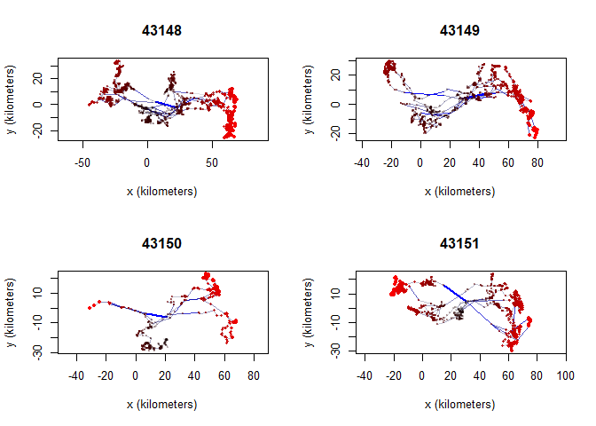

# Caribou data


## Introduction

The first step of the analysis is to explore the Little Rancheria
telemetry data and generate some minimum convex polygons (MCPs). Our
objectives are to:

- Clean YT gps data, remove outliers, create seasonal KDEs

- Read raw collar data and format as movebank data

- Read Little Rancheria telemetry data

- Summarize number of collars, years, and locations

- Select subset of data for further analysis i.e., drop older locations
  without IDs

- Plot the distribution of locations by year for subset of data

- Map the distribution of locations by Collar ID

- Create 100 MCP for all locations and buffer by 5km

``` r
library(sf)
library(ctmm)
library(tidyverse)
library(adehabitatHR)
ytdir <- "H:/Shared drives/Little Rancheria/Yukon/"
bcdir <- "H:/Shared drives/Little Rancheria/BC/"
```

## Yukon data

### Read caribou collar data and save to local drive

We start by reading the telemetry data from the csv file and converting
it to a simple feature point file. To do this we read the GPS locations,
convert them to an sf object, create long/lat coordinates, and project
to the standard Yukon Albers projection (EPSG:3578). We also created a
new field called year to allow us to filter observations by year. A
number of older locations are not associated with a Collar_ID. We will
exclude them for now. Finally, we save the gps coordinates in a
geopackage file.

``` r
raw <- st_read(paste0(ytdir, "LRCH_2020-2024_GPSCollar_points.shp"), quiet=TRUE) |>
  st_drop_geometry()
write_csv(raw, '../../data/yt/raw_data.csv')
```

### Read locations and convert to simple features (sf object)

``` r
gps <- read.csv('../../data/yt/gps.csv') |>
  st_as_sf(coords=c('longitude', 'latitude'), crs=4326) |>
  st_transform(3578)
st_write(gps, '../../data/yt_caribou.gpkg', 'gps', delete_layer=TRUE)
```

    Deleting layer `gps' using driver `GPKG'
    Writing layer `gps' to data source `../../data/yt_caribou.gpkg' using driver `GPKG'
    Writing 90864 features with 3 fields and geometry type Point.

### Convert to movebank-ish format and save

``` r
gps <- raw |> dplyr::select(timestamp, long, lat, tag_ident) |>
  rename(longitude=long, latitude=lat, ID=tag_ident)
```

### Check that date range is correct

``` r
max(gps$timestamp)
```

    [1] "2024-03-14 21:17:51"

``` r
min(gps$timestamp)
```

    [1] "2020-11-03 19:19:10"

### Check for duplicated locations

``` r
summary(duplicated(gps))
```

       Mode   FALSE 
    logical   90864 

### Convert ‘timestamp’ column to Date class to separate seasons

``` r
gps <- gps |> mutate(date = as.Date(timestamp))
glimpse(gps)
```

    Rows: 90,864
    Columns: 5
    $ timestamp <chr> "2020-11-06 19:10:39", "2020-11-07 01:07:00", "2020-11-07 07…
    $ longitude <dbl> -129.2876, -129.3327, -129.3022, -129.3021, -129.3146, -129.…
    $ latitude  <dbl> 60.24530, 60.19127, 60.17469, 60.17254, 60.14960, 60.14822, …
    $ ID        <chr> "43163", "43163", "43163", "43163", "43163", "43163", "43163…
    $ date      <date> 2020-11-06, 2020-11-07, 2020-11-07, 2020-11-07, 2020-11-07,…

## Split data into seasons

### Selected date ranges

The seasonal date ranges are the same as those initially used for the
Klaza and Clear Creek herds (Maegan, personal communication). These
should be revisited with regional biologists and revised as necessary.

<details class="code-fold">
<summary>Code</summary>

``` r
# Early winter: Oct 21 - Jan 31
ew2020_start <- as.Date("2019-10-21")
ew2020_end <- as.Date("2020-01-31")
ew2021_start <- as.Date("2020-10-21")
ew2021_end <- as.Date("2021-01-31")
ew2022_start <- as.Date("2021-10-21")
ew2022_end <- as.Date("2022-01-31")
ew2023_start <- as.Date("2022-10-21")
ew2023_end <- as.Date("2023-01-31")
ew2024_start <- as.Date("2023-10-21")
ew2024_end <- as.Date("2024-01-31")

# Late winter: Feb 1 - Apr 15
lw2020_start <- as.Date("2020-02-01")
lw2020_end <- as.Date("2020-04-15")
lw2021_start <- as.Date("2021-02-01")
lw2021_end <- as.Date("2021-04-15")
lw2022_start <- as.Date("2022-02-01")
lw2022_end <- as.Date("2022-04-15")
lw2023_start <- as.Date("2023-02-01")
lw2023_end <- as.Date("2023-04-15")
lw2024_start <- as.Date("2024-02-01")
lw2024_end <- as.Date("2024-04-15")

# Summer: June 16 - Sept 14
su2020_start <- as.Date("2020-06-16")
su2020_end <- as.Date("2020-09-14")
su2021_start <- as.Date("2021-06-16")
su2021_end <- as.Date("2021-09-14")
su2022_start <- as.Date("2022-06-16")
su2022_end <- as.Date("2022-09-14")
su2023_start <- as.Date("2023-06-16")
su2023_end <- as.Date("2023-09-14")
su2024_start <- as.Date("2024-06-16")
su2024_end <- as.Date("2024-09-14")

# Fall rut: Sept 15 - Oct 20
fr2020_start <- as.Date("2020-09-15")
fr2020_end <- as.Date("2020-10-20")
fr2021_start <- as.Date("2021-09-15")
fr2021_end <- as.Date("2021-10-20")
fr2022_start <- as.Date("2022-09-15")
fr2022_end <- as.Date("2022-10-20")
fr2023_start <- as.Date("2023-09-15")
fr2023_end <- as.Date("2023-10-20")
fr2024_start <- as.Date("2024-09-15")
fr2024_end <- as.Date("2024-10-20")

# Create new attribute called season
gps <- gps %>%
  mutate(
    season=case_when(
      (date >= ew2020_start & date <= ew2020_end) |
      (date >= ew2021_start & date <= ew2021_end) |
      (date >= ew2022_start & date <= ew2022_end) |
      (date >= ew2023_start & date <= ew2023_end) |
      (date >= ew2024_start & date <= ew2024_end) ~ 'earlywinter',
      (date >= lw2020_start & date <= lw2020_end) |
      (date >= lw2021_start & date <= lw2021_end) |
      (date >= lw2022_start & date <= lw2022_end) |
      (date >= lw2023_start & date <= lw2023_end) |
      (date >= lw2024_start & date <= lw2024_end) ~ 'latewinter',
      (date >= su2020_start & date <= su2020_end) |
      (date >= su2021_start & date <= su2021_end) |
      (date >= su2022_start & date <= su2022_end) |
      (date >= su2023_start & date <= su2023_end) |
      (date >= su2024_start & date <= su2024_end) ~ 'summer',
      (date >= fr2020_start & date <= fr2020_end) |
      (date >= fr2021_start & date <= fr2021_end) |
      (date >= fr2022_start & date <= fr2022_end) |
      (date >= fr2023_start & date <= fr2023_end) |
      (date >= fr2024_start & date <= fr2024_end) ~ 'fallrut',
      .default = 'other'), date=NULL)
```

</details>

### Check data

``` r
glimpse(gps)
```

    Rows: 90,864
    Columns: 5
    $ timestamp <chr> "2020-11-06 19:10:39", "2020-11-07 01:07:00", "2020-11-07 07…
    $ longitude <dbl> -129.2876, -129.3327, -129.3022, -129.3021, -129.3146, -129.…
    $ latitude  <dbl> 60.24530, 60.19127, 60.17469, 60.17254, 60.14960, 60.14822, …
    $ ID        <chr> "43163", "43163", "43163", "43163", "43163", "43163", "43163…
    $ season    <chr> "earlywinter", "earlywinter", "earlywinter", "earlywinter", …

### Number of locations per season

``` r
table(gps$season)
```


    earlywinter     fallrut  latewinter       other      summer 
          30041        7465       20191       13773       19394 

## Save GPS data with seasons

``` r
write_csv(gps, '../../data/yt/gps.csv')
```

## Check for outliers

### Outlier plots: y distance (km) vs x distance (km) for each individual caribou.

``` r
par(mfrow=c(2,2))
out = outlie(data = tel, plot = TRUE, by = 'd')
```





### Outlier plot: minimum speed (m/s) vs. median deviation (km) for all caribou individuals.

``` r
par(mfrow=c(1,1))
plot(out)
```


## BC data

## Preparing telemetry data

We start by reading the telemetry data from the csv file and converting
it to a simple feature point file. To do this we read the GPS locations,
convert them to an sf object, create long/lat coordinates, and project
to the standard Yukon Albers projection (EPSG:3578). We also created a
new field called year to allow us to filter observations by year. A
number of older locations are not associated with a Collar_ID. We will
exclude them for now. Finally, we save the gps coordinates in a
geopackage file.

``` r
gps_all <- read_csv(paste0(bcdir, 'Telemetry_LittleRancheria.csv')) |>
  st_as_sf(coords=c('Longitude', 'Latitude'), crs=4326) |>
  mutate(...1=NULL, Year=substr(Fix_Date,1,4)) |>
  st_transform(3578)
st_write(gps_all, '../../data/bc/caribou_ranges.gpkg', 'locations', delete_layer=TRUE)
```

Select and save locations without IDs. These are older non-gps locations
that may be of value for analysing change at the population level.

``` r
gps_na <- filter(gps_all, is.na(Collar_ID))
st_write(gps_na, '../../data/bc/caribou_ranges.gpkg', 'locations_without_id', delete_layer=TRUE)
```

Select and save locations with IDs.

``` r
gps <- filter(gps_all, !is.na(Collar_ID))
st_write(gps, '../../data/bc/caribou_ranges.gpkg', 'locations_with_id', delete_layer=TRUE)
```

### Locations by caribou by year

We start by viewing the number of locations by caribou and year. Caribou
without a Collar_ID were monitored between 1996-2001. For now we will
focus exclusively of caribou with a Collar_ID.

Caribou with Collar IDs

``` r
table(gps$Year)
```

Caribou without Collar IDs

``` r
table(gps_na$Year)
```

Locations by year for caribou with Collar_ID

``` r
table(gps$Collar_ID, gps$Year)
```

### Locations by year

We can also see the distribution of all collar locations using the
facet_wrap function of `ggplot2`. Based on the plot and the previous
table we can see that there are a lot more locations between 2021-2023.

``` r
ggplot(data=gps) +
  geom_sf() + 
  facet_wrap(facets=vars(Year))
```

### View all gps locations

The following map shows the distribution of locations for caribou with
and without a Collar ID.

``` r
gps_all <- mutate(gps_all, Collar_ID2=ifelse(is.na(Collar_ID), "No", "Yes"))
ggplot() +
  geom_sf(data=gps_all, aes(color=as.factor(Collar_ID2)), size=0.50) +
  scale_color_discrete(name="Collar ID")
```

## Create minimum convex polygons

Create minimum convex polygons:

- for each caribou with greater than four locations
- for all caribous (dissolved) and add a 5km buffer

The second MCP will be used to define the study area.

``` r
mcp <- NULL
imcp <- NULL
for (i in unique(gps$Collar_ID)) {
  #cat('Processing', i, '\n'); flush.console()
  gps1 <- filter(gps, Collar_ID==i) %>%
    dplyr::select(Collar_ID)
  if (nrow(gps1)>=5) {
    gps1.sp <- as_Spatial(gps1)
    gps1.mcp <- mcp(gps1.sp, percent=100)
    mcp1 <- st_as_sf(gps1.mcp)
    if (i==gps$Collar_ID[1]) {
      mcp <- mcp1
      imcp <- mcp1
    } else {
      mcp <- st_union(mcp, mcp1)
      imcp <- rbind(imcp, mcp1)
    }
  }
}
st_write(mcp, '../../data/bc/caribou_ranges.gpkg', 'mcp', delete_layer=TRUE)
st_write(imcp, '../../data/bc/caribou_ranges.gpkg', 'imcp', delete_layer=TRUE)
```

Add 5-km buffer to sum of MCPs

``` r
mcp5k <- st_buffer(mcp, 5000) %>%
  dplyr::select(id) %>%
  mutate(id = 'MCP + 5k') %>%
  st_transform(3578)
st_write(mcp5k, '../../data/bc/caribou_ranges.gpkg', 'mcp_buff5k', delete_layer=TRUE)
```

### Plot individual MCPs

Here we plot 100% minimum convex polygons (MCPs) for all caribou with
Collar IDs.

``` r
ggplot() +
  geom_sf(data=imcp, fill=NA)
```

### Plot combined MCP + 5k buffer

``` r
ggplot() +
  geom_sf(data=gps, aes(color=as.factor(Collar_ID)), size=0.50) +
  geom_sf(data=mcp5k, fill=NA) +
  scale_color_discrete(guide="none")
```
