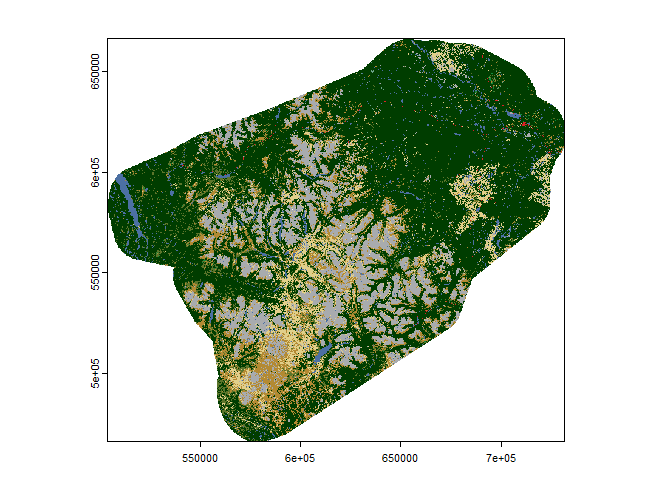
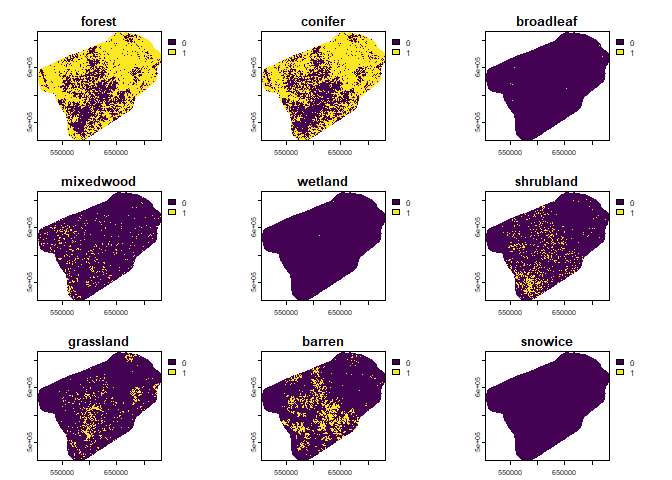
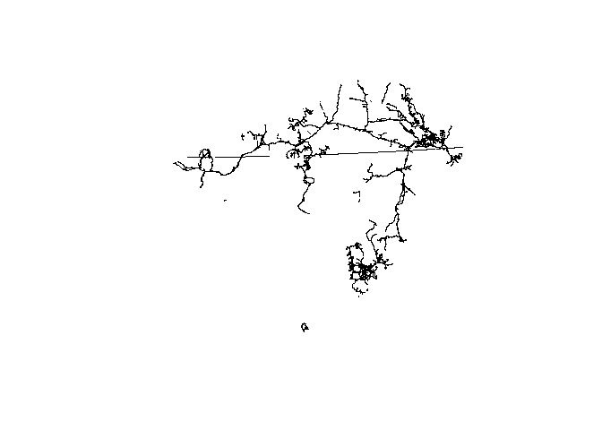
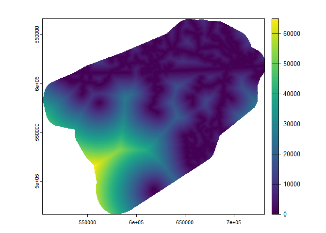
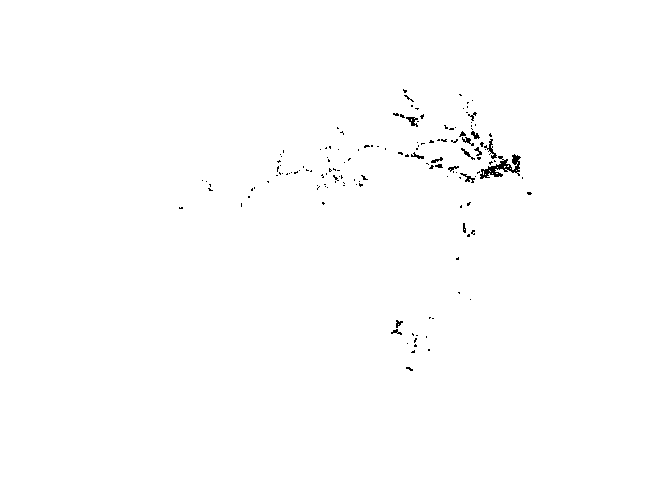
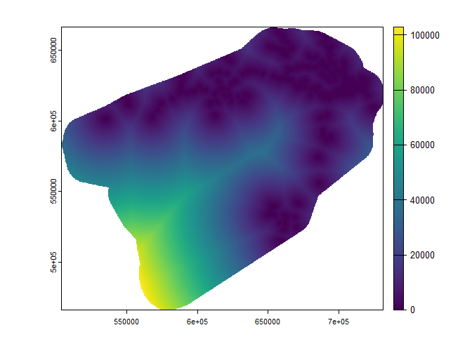
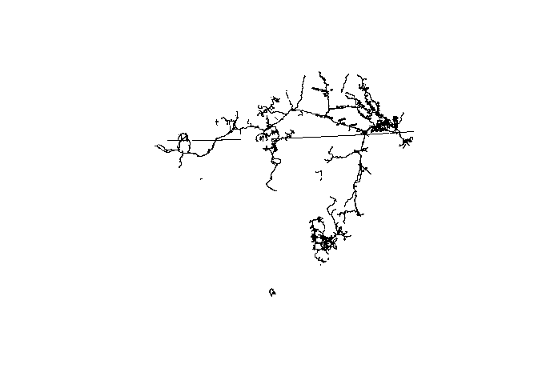
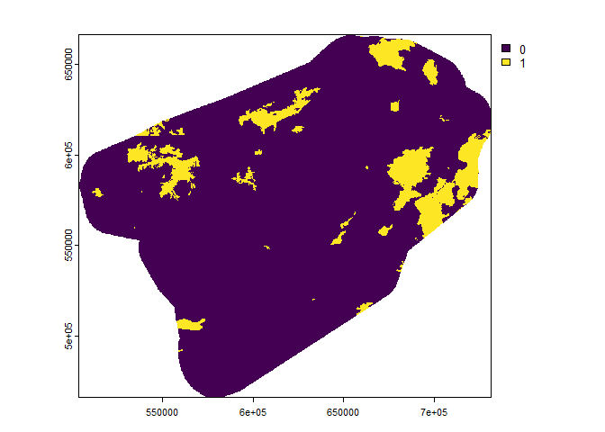
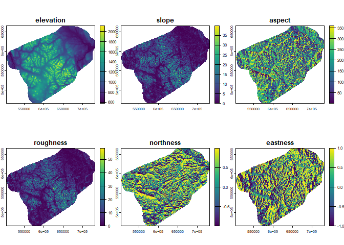
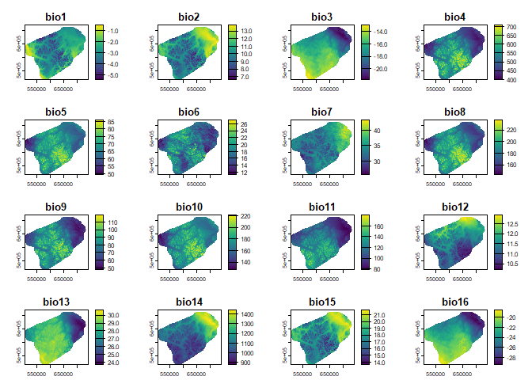

# Covariate data


## Introduction

Objectives:

- Prepare raster covariate data

``` r
library(sf)
```

    Linking to GEOS 3.12.1, GDAL 3.8.4, PROJ 9.3.1; sf_use_s2() is TRUE

``` r
library(terra)
```

    terra 1.7.78

``` r
library(tidyverse)
```

    ── Attaching core tidyverse packages ──────────────────────── tidyverse 2.0.0 ──
    ✔ dplyr     1.1.4     ✔ readr     2.1.5
    ✔ forcats   1.0.0     ✔ stringr   1.5.1
    ✔ ggplot2   3.5.1     ✔ tibble    3.2.1
    ✔ lubridate 1.9.3     ✔ tidyr     1.3.1
    ✔ purrr     1.0.2     

    ── Conflicts ────────────────────────────────────────── tidyverse_conflicts() ──
    ✖ tidyr::extract() masks terra::extract()
    ✖ dplyr::filter()  masks stats::filter()
    ✖ dplyr::lag()     masks stats::lag()
    ℹ Use the conflicted package (<http://conflicted.r-lib.org/>) to force all conflicts to become errors

**Set working directory and folder locations**

``` r
dropbox <- 'C:/Users/PIVER37/BEACONs Dropbox/pierre vernier/prv_gisdata/north_america/climate/worldclim/'
#bpdata <- 'C:/Users/PIVER37/Documents/github/beaconsproject/geopackage_creator/www/bp_datasets.gpkg'
bpdata <- 'H:/Shared drives/Disturbance Mapping (digitizing)/Data/geopackage_creator/bp_datasets.gpkg'
```

**Read boundary**

``` r
bnd <- st_read('../../data/yt_caribou.gpkg', 'mcp_buff15k')
```

    Reading layer `mcp_buff15k' from data source 
      `C:\Users\PIVER37\Desktop\Projects\little_rancheria\data\yt_caribou.gpkg' 
      using driver `GPKG'
    Simple feature collection with 1 feature and 1 field
    Geometry type: POLYGON
    Dimension:     XY
    Bounding box:  xmin: 503684.6 ymin: 465919.2 xmax: 731665.5 ymax: 666695.1
    Projected CRS: NAD83 / Yukon Albers

``` r
bnd_4326 <- st_transform(bnd, 4326)
```

## RASTER TEMPLATE (30-m resolution)

First use QGIS to extract NALC2020 by mask and save in 3578

Then read raster and create boundary raster template

``` r
nalc <- rast('../../data/raster30/nalc2020.tif')
rast30m <- subst(nalc, 1:19, 1)
plot(nalc)
```



## LANDCOVER

### NALC 2020: forest, wetlands

``` r
forest <- ifel(nalc %in% c(1,2,5,6), 1, 0) |>
  mask(rast30m)
names(forest)='forest'
conif <- ifel(nalc %in% c(1,2), 1, 0) |>
  mask(rast30m)
names(conif)='conifer'
decid <- ifel(nalc==5, 1, 0)
names(decid)='broadleaf'
mixed <- ifel(nalc==6, 1, 0)
names(mixed)='mixedwood'
wetland <- ifel(nalc==14, 1, 0) |>
  mask(rast30m)
names(wetland)='wetland'
shrub <- ifel(nalc %in% c(8,11), 1, 0) |>
  mask(rast30m)
names(shrub)='shrubland'
grass <- ifel(nalc %in% c(10,12), 1, 0) |>
  mask(rast30m)
names(grass)='grassland'
barren <- ifel(nalc %in% c(13,16), 1, 0) |>
  mask(rast30m)
names(barren)='barren'
snowice <- ifel(nalc==19, 1, 0)
names(snowice)='snowice'
#Combine and save
landcov <- c(forest, conif, decid, mixed, wetland, shrub, grass, barren, snowice)
writeRaster(landcov, '../../data/raster30/landcov.tif', overwrite=TRUE)
```


    |---------|---------|---------|---------|
    =========================================
                                              

``` r
plot(landcov)
```



## DISTURBANCES - HUMAN

### Distance to linear disturbances

``` r
line <- st_read(bpdata, 'sd_line') |>
  st_intersection(bnd) |>
  mutate(id=NULL)
```

    Reading layer `sd_line' from data source 
      `H:\Shared drives\Disturbance Mapping (digitizing)\Data\geopackage_creator\bp_datasets.gpkg' 
      using driver `GPKG'
    Simple feature collection with 260864 features and 2 fields (with 1 geometry empty)
    Geometry type: MULTILINESTRING
    Dimension:     XY
    Bounding box:  xmin: 64737.1 ymin: 186673.8 xmax: 1244604 ymax: 1560027
    Projected CRS: NAD83 / Yukon Albers

    Warning: attribute variables are assumed to be spatially constant throughout
    all geometries

``` r
st_write(line, '../../data/bp_covars.gpkg', 'linear_disturbance', delete_layer=TRUE)
```

    Deleting layer `linear_disturbance' using driver `GPKG'
    Writing layer `linear_disturbance' to data source 
      `../../data/bp_covars.gpkg' using driver `GPKG'
    Writing 6602 features with 2 fields and geometry type Unknown (any).

``` r
plot(st_geometry(line))
```



``` r
dist2line <- rasterize(vect(line), rast30m) |>
  distance() |>
  mask(rast30m)
writeRaster(dist2line, '../../data/raster30/dist2line.tif', overwrite=TRUE)
plot(dist2line)
```



### Distance to areal disturbances

``` r
poly <- st_read(bpdata, 'sd_poly') |>
  st_intersection(bnd) |>
  mutate(id=NULL)
```

    Reading layer `sd_poly' from data source 
      `H:\Shared drives\Disturbance Mapping (digitizing)\Data\geopackage_creator\bp_datasets.gpkg' 
      using driver `GPKG'
    Simple feature collection with 176482 features and 2 fields
    Geometry type: MULTIPOLYGON
    Dimension:     XY
    Bounding box:  xmin: 64763.55 ymin: 46283.61 xmax: 1270670 ymax: 1495825
    Projected CRS: NAD83 / Yukon Albers

    Warning: attribute variables are assumed to be spatially constant throughout
    all geometries

``` r
st_write(poly, '../../data/bp_covars.gpkg', 'areal_disturbance', delete_layer=TRUE)
```

    Deleting layer `areal_disturbance' using driver `GPKG'
    Writing layer `areal_disturbance' to data source 
      `../../data/bp_covars.gpkg' using driver `GPKG'
    Writing 910 features with 2 fields and geometry type Unknown (any).

``` r
plot(st_geometry(poly))
```



``` r
dist2poly <- rasterize(vect(poly), rast30m) |> 
  distance() |>
  mask(rast30m)
```

    Warning: [SpatVector from sf] not all geometries were transferred, use svc for
    a geometry collection

``` r
writeRaster(dist2poly, '../../data/raster30/dist2poly.tif', overwrite=TRUE)
plot(dist2poly)
```



### Distance to linear and areal disturbances

``` r
linep <- st_buffer(line, 1)
linepoly <- rbind(linep, poly)
st_write(linepoly, '../../data/bp_covars.gpkg', 'all_disturbance', delete_layer=TRUE)
```

    Deleting layer `all_disturbance' using driver `GPKG'
    Writing layer `all_disturbance' to data source 
      `../../data/bp_covars.gpkg' using driver `GPKG'
    Writing 7512 features with 2 fields and geometry type Unknown (any).

``` r
plot(st_geometry(linepoly))
```



``` r
dist2linepoly <- rasterize(vect(linepoly), rast30m) |>
  distance() |>
  mask(rast30m)
```

    Warning: [SpatVector from sf] not all geometries were transferred, use svc for
    a geometry collection

``` r
writeRaster(dist2linepoly, '../../data/raster30/dist2linepoly.tif', overwrite=TRUE)
plot(dist2linepoly)
```


## NEIGHBOURHOOD VARIABLES

## DISTURBANCES - NATURAL

### Fires

``` r
# Fires: clip and rasterize
fires <- vect(bpdata, 'fires') |>
  crop(vect(bnd)) |>
  rasterize(rast30m) |>
  mask(rast30m)
fires <- subst(fires, NA, 0) |>
  mask(rast30m)
names(fires) <- "fires"
writeRaster(fires, '../../data/raster30/fires.tif', overwrite=TRUE)
plot(fires)
```



## TOPOGRAPHY

``` r
# Read, resample, and clip ccdem
dem <- rast('C:/Users/PIVER37/BEACONs Dropbox/pierre vernier/prv_gisdata/canada/dem/can3d30.asc')
dem1 <- crop(dem, bnd_4326)
dem2 <- mask(dem1, bnd_4326)
elev <- project(dem2, nalc, res=30)
names(elev) <- 'elevation'
slope <- terrain(elev, v="slope", neighbors=8, unit="degrees")
names(slope) <- "slope"
rough <- terrain(elev, v="roughness", neighbors=8)
names(rough) <- "roughness"
aspect <- terrain(elev, v="aspect", neighbors=8)
names(aspect) <- "aspect"
north <- cos(aspect * pi / 180)
names(north) <- "northness"
east <- sin(aspect * pi / 180)
names(east) <- "eastness"
topo <- c(elev, slope, aspect, rough, north, east)
writeRaster(topo, '../../data/raster30/topo.tif', overwrite=TRUE)
```


    |---------|---------|---------|---------|
    =========================================
                                              

``` r
plot(topo)
```



## BIOCLIMATE (1-km resolution)

``` r
# Uncomment if downloading for first time
#d1 <- worldclim_tile(var='bio', lon=-128, lat=59, path='../../data/tmp')
#d2 <- worldclim_tile(var='bio', lon=-128, lat=61, path='../../data/tmp')

# Uncomment if previously downloaded
t1 <- rast(paste0(dropbox, 'tile_14_wc2.1_30s_bio.tif'))
names(t1) <- paste0("bio", c(1:19))
t2 <- rast(paste0(dropbox, 'tile_2_wc2.1_30s_bio.tif'))
names(t2) <- paste0("bio", c(1:19))

# Clip to study area
t1_crop <- crop(t1, bnd_4326)
t1_msk <- mask(t1_crop, bnd_4326)
t2_crop <- crop(t2, bnd_4326)
t2_msk <- mask(t2_crop, bnd_4326)
tt <- merge(t1_msk, t2_msk)
tt_3578 <- project(tt, "EPSG:3578")
writeRaster(tt_3578, '../../data/raster1000/bio.tif', overwrite=TRUE)

# Plot bioclimate data
plot(tt_3578)
```


