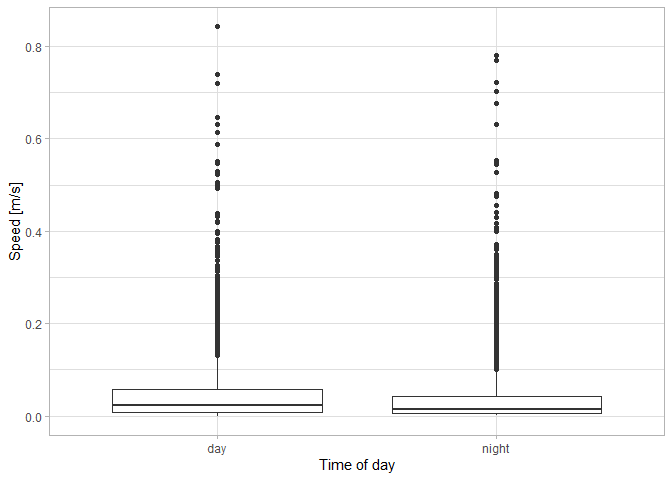

# Create tracks


## Introduction

Objectives:

- Create minimum convex polygons for individual caribou
- Calculate movement rates

``` r
library(sf)
library(amt)
library(tidyverse)
library(lubridate)
```

**Read caribou locations (csv file**)

We first read the caribou location data as a csv file. If we use the
read.csv function we would have to convert the timestamp field to
datetime format (see commented lines below). Conversely, the read_csv
function automatically detects the timestamp field. We next modify the
field names to match the column names expected by the `amt` package.

``` r
#gps <- read.csv('data/yt/gps.csv') |> mutate(timestamp=as.POSIXct(timestamp))
#gps <- read.csv('data/yt/gps.csv') |> mutate(timestamp=ymd_hms(timestamp, tz="GMT"))
gps <- read_csv('../../data/yt/gps.csv') |>
  rename(t_=timestamp,
  x_=longitude, 
  y_=latitude) |>
  mutate(id=paste0('C',ID),
  timestamp=NULL, ID=NULL)
```

    Rows: 90864 Columns: 5
    ── Column specification ────────────────────────────────────────────────────────
    Delimiter: ","
    chr  (1): season
    dbl  (3): longitude, latitude, ID
    dttm (1): timestamp

    ℹ Use `spec()` to retrieve the full column specification for this data.
    ℹ Specify the column types or set `show_col_types = FALSE` to quiet this message.

``` r
glimpse(gps)
```

    Rows: 90,864
    Columns: 5
    $ t_     <dttm> 2020-11-06 19:10:39, 2020-11-07 01:07:00, 2020-11-07 07:05:54,…
    $ x_     <dbl> -129.2876, -129.3327, -129.3022, -129.3021, -129.3146, -129.338…
    $ y_     <dbl> 60.24530, 60.19127, 60.17469, 60.17254, 60.14960, 60.14822, 60.…
    $ season <chr> "earlywinter", "earlywinter", "earlywinter", "earlywinter", "ea…
    $ id     <chr> "C43163", "C43163", "C43163", "C43163", "C43163", "C43163", "C4…

**Make tracks**

Read the data set `data/elephants.csv` (note file paths always start
globally). Create a track using, make sure that you set the CRS to 4326.
Ensure that the timezone is “GMT”. Then, transform the track to a
projected UTM CRS. Here we the Yukon Albers projection
(https://epsg.io/3578).

``` r
trk <- make_track(gps, x_, y_, t_, id = id, season=season, crs = 4326) |>
  transform_coords(crs_to = 3578)
trk
```

    # A tibble: 90,864 × 5
            x_      y_ t_                  id     season     
     *   <dbl>   <dbl> <dttm>              <chr>  <chr>      
     1 606014. 563800. 2020-11-03 19:19:10 C43161 earlywinter
     2 606921. 564631. 2020-11-03 19:19:11 C43147 earlywinter
     3 607072. 564647. 2020-11-03 19:19:15 C43146 earlywinter
     4 613483. 568035. 2020-11-04 01:18:15 C43144 earlywinter
     5 614729. 567940. 2020-11-04 01:18:22 C43159 earlywinter
     6 614729. 567937. 2020-11-04 01:18:37 C43141 earlywinter
     7 605307. 565229. 2020-11-04 01:18:38 C43158 earlywinter
     8 608083. 564296. 2020-11-04 01:18:39 C43164 earlywinter
     9 614007. 569526. 2020-11-04 01:18:40 C43147 earlywinter
    10 614018. 569523. 2020-11-04 01:19:24 C43146 earlywinter
    # ℹ 90,854 more rows

**Summarize sampling rate for one caribou for one year**

Filter only for the first individual `"C43140"`. Only use data for the
year 2020. What is is the sampling rate?

``` r
trk1 <- trk |> filter(id == "C43140", year(t_) > 2000)
from_to(trk)
```

    [1] "2020-11-03 19:19:10 UTC" "2024-03-14 21:17:51 UTC"

``` r
from_to(trk1)
```

    [1] "2020-11-05 01:14:38 UTC" "2024-03-13 09:23:38 UTC"

``` r
summarize_sampling_rate(trk1)
```

    # A tibble: 1 × 9
        min    q1 median  mean    q3   max    sd     n unit 
      <dbl> <dbl>  <dbl> <dbl> <dbl> <dbl> <dbl> <int> <chr>
    1  5.94  5.98   5.98  6.01  5.98  29.9 0.505  4890 hour 

**Summarize sampling rates for all (25) caribou for all years**

``` r
print(summarize_sampling_rate_many(trk, cols='id'), n=25)
```

    # A tibble: 25 × 10
       id       min    q1 median  mean    q3    max     sd     n unit 
     * <chr>  <dbl> <dbl>  <dbl> <dbl> <dbl>  <dbl>  <dbl> <int> <chr>
     1 C43161 0.474  5.98   5.98  7.14  5.99 1173.  27.9    1759 hour 
     2 C43147 5.94   5.98   5.98  6.01  5.98   12.0  0.389  2126 hour 
     3 C43146 5.94   5.98   5.98  6.01  5.98   29.9  0.505  4898 hour 
     4 C43144 5.94   5.98   5.98  6.00  5.98   12.0  0.283  4908 hour 
     5 C43159 5.94   5.98   5.98  6.00  5.98   12.0  0.351  4904 hour 
     6 C43141 5.94   5.98   5.98  6.01  5.98   29.9  0.573  4901 hour 
     7 C43158 5.94   5.98   5.98  6.00  5.98   12.0  0.356  2259 hour 
     8 C43164 5.94   5.98   5.98  6.01  5.98   29.9  0.483  4899 hour 
     9 C43150 5.94   5.98   5.98  6.06  5.99   29.9  1.04    693 hour 
    10 C43154 5.94   5.98   5.98  6.00  5.98   29.9  0.435  4902 hour 
    11 C43145 5.94   5.98   5.98  6.00  5.98   29.9  0.418  4904 hour 
    12 C43143 5.94   5.98   5.98  5.99  5.98   12.0  0.241  4910 hour 
    13 C43140 5.94   5.98   5.98  6.01  5.98   29.9  0.505  4890 hour 
    14 C43155 5.94   5.98   5.98  6.06  5.98   29.9  0.992   976 hour 
    15 C43156 5.95   5.98   5.98  6.05  5.98   29.9  1.17    445 hour 
    16 C43160 5.94   5.98   5.98  6.01  5.98   29.9  0.483  4895 hour 
    17 C43152 5.94   5.98   5.98  6.00  5.98   12.0  0.270  4907 hour 
    18 C43148 5.95   5.98   5.98  6.01  5.98   29.9  0.554  2562 hour 
    19 C43151 5.94   5.98   5.98  6.02  5.99   12.0  0.484  1823 hour 
    20 C43142 5.94   5.98   5.98  6.03  5.98  126.   1.76   4874 hour 
    21 C43149 5.94   5.98   5.98  6.02  5.99   29.9  0.621  2496 hour 
    22 C43162 5.94   5.98   5.98  6.03  5.98   29.9  0.704  2230 hour 
    23 C43153 5.94   5.98   5.98  6.00  5.98   53.9  0.720  4896 hour 
    24 C43157 5.94   5.98   5.98  6.01  5.98   29.9  0.468  4890 hour 
    25 C43163 5.94   5.98   5.98  6.00  5.98   12    0.331  4892 hour 

**Calculate speed**

Calculate the speed (i.e., the distance per unit time) for each
relocation, and the time of the day for each relocation.

``` r
trk2 <- trk1 %>% mutate(speed = speed(.)) %>%
  time_of_day()
trk2
```

    # A tibble: 4,891 × 7
            x_      y_ t_                  id     season         speed tod_ 
         <dbl>   <dbl> <dttm>              <chr>  <chr>          <dbl> <fct>
     1 601985. 561407. 2020-11-05 01:14:38 C43140 earlywinter 0.0312   night
     2 602336. 561980. 2020-11-05 07:13:21 C43140 earlywinter 0.000561 night
     3 602329. 561990. 2020-11-05 13:12:38 C43140 earlywinter 0.137    night
     4 604716. 563710. 2020-11-05 19:11:12 C43140 earlywinter 0.0509   day  
     5 605802. 563872. 2020-11-06 01:10:35 C43140 earlywinter 0.000290 night
     6 605805. 563877. 2020-11-06 07:09:37 C43140 earlywinter 0.00687  night
     7 605938. 563942. 2020-11-06 13:08:38 C43140 earlywinter 0.186    night
     8 609936. 563955. 2020-11-06 19:07:38 C43140 earlywinter 0.0457   day  
     9 608954. 563884. 2020-11-07 01:06:35 C43140 earlywinter 0.00227  night
    10 609000. 563868. 2020-11-07 07:05:29 C43140 earlywinter 0.00215  night
    # ℹ 4,881 more rows

**Speed and time of day**

Does speed differ between time of day?

``` r
theme_set(theme_light())
ggplot(trk2, aes(tod_, speed)) +
  geom_boxplot() +
  labs(x = "Time of day", y = "Speed [m/s]")
```

    Warning: Removed 1 row containing non-finite outside the scale range
    (`stat_boxplot()`).



Add a new column to the data set that indicates the months of the year
when each relocation was taken. Does the association between speed and
temperature remains the same for each month? Explore this graphically
and calculate monthly means and median for speeds.

``` r
trk3 <- mutate(trk2, month = month(t_, label = TRUE))
trk3 %>% group_by(month, tod_) %>% 
  summarise(m = mean(speed), sd = sd(speed))
```

    `summarise()` has grouped output by 'month'. You can override using the
    `.groups` argument.

    # A tibble: 24 × 4
    # Groups:   month [12]
       month tod_        m      sd
       <ord> <fct>   <dbl>   <dbl>
     1 Jan   day    0.0661  0.0972
     2 Jan   night  0.0309  0.0591
     3 Feb   day    0.0540  0.0920
     4 Feb   night  0.0359  0.0732
     5 Mar   day    0.0348  0.0587
     6 Mar   night NA      NA     
     7 Apr   day    0.0354  0.0532
     8 Apr   night  0.0156  0.0200
     9 May   day    0.0540  0.100 
    10 May   night  0.0423  0.102 
    # ℹ 14 more rows

**Create tracks with equal sampling rates (bursts)**

If there are gaps and/or different sampling rates, interpolation with
continuous time movement models may be an option (Jonsen et al. 2023.
aniMotum, an R package for animal movement data)

``` r
print(track_resample(trk))
```

    # A tibble: 4,925 × 6
            x_      y_ t_                  id     season      burst_
     *   <dbl>   <dbl> <dttm>              <chr>  <chr>        <dbl>
     1 606014. 563800. 2020-11-03 19:19:10 C43161 earlywinter      1
     2 613483. 568035. 2020-11-04 01:18:15 C43144 earlywinter      2
     3 608086. 564280. 2020-11-04 07:17:15 C43164 earlywinter      3
     4 615099. 571114. 2020-11-04 13:16:27 C43159 earlywinter      4
     5 615492. 575275. 2020-11-04 19:15:10 C43146 earlywinter      5
     6 619801. 579694. 2020-11-05 01:14:17 C43144 earlywinter      6
     7 629095. 585540. 2020-11-05 07:13:11 C43146 earlywinter      7
     8 672763. 633945. 2020-11-05 13:12:21 C43156 earlywinter      8
     9 604716. 563710. 2020-11-05 19:11:12 C43140 earlywinter      9
    10 633605. 588892. 2020-11-06 01:10:15 C43159 earlywinter     10
    # ℹ 4,915 more rows
