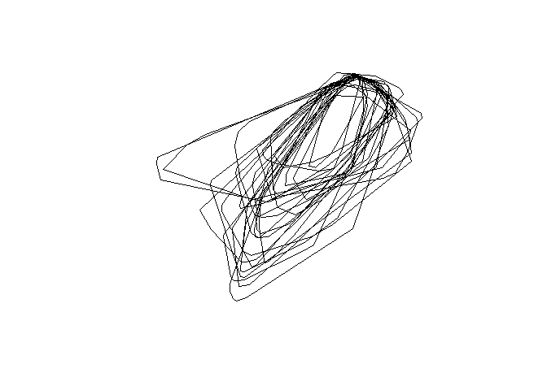
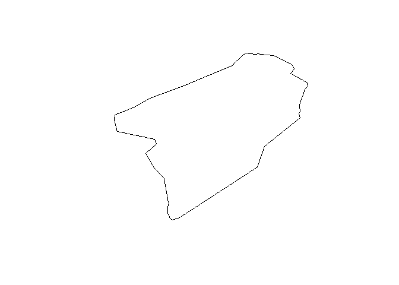
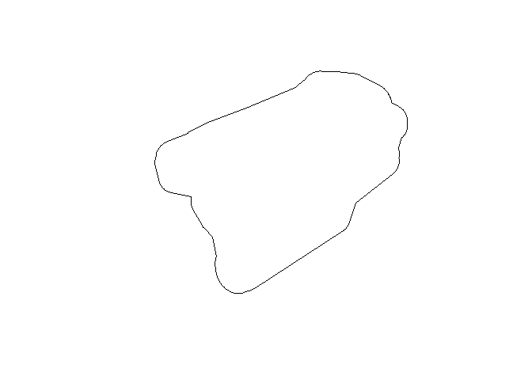

# Create tracks


## Introduction

Objectives:

- Create minimum convex polygons for:
  - individual caribou
  - all caribou (merged individual MCPs + 15km buffer) The second MCP
    will be used to define the limit of the study region

``` r
library(sf)
library(tidyverse)
library(adehabitatHR)
```

### Read locations and convert to simple features (sf object)

``` r
gps <- st_read('../../data/yt_caribou.gpkg', 'gps', quiet=TRUE)
glimpse(gps)
```

    Rows: 90,864
    Columns: 4
    $ timestamp <chr> "2020-11-06 19:10:39", "2020-11-07 01:07:00", "2020-11-07 07…
    $ ID        <int> 43163, 43163, 43163, 43163, 43163, 43163, 43163, 43163, 4316…
    $ season    <chr> "earlywinter", "earlywinter", "earlywinter", "earlywinter", …
    $ geom      <POINT [m]> POINT (678102.7 642940.6), POINT (675905.1 636811.4), …

### Create 100% MCP for each individual

``` r
imcp <- NULL # for individual MCPs
mcp <- NULL # for merged MCPs
for (i in unique(gps$ID)) {
  gps1 <- filter(gps, ID==i) %>%
    dplyr::select(ID)
  if (nrow(gps1)>=5) {
    gps1.sp <- as_Spatial(gps1)
    gps1.mcp <- mcp(gps1.sp, percent=100)
    mcp1 <- st_as_sf(gps1.mcp)
    if (i==gps$ID[1]) {
      imcp <- mcp1
      mcp <- mcp1
    } else {
      imcp <- rbind(imcp, mcp1)
      mcp <- st_union(mcp, mcp1)
    }
  }
}
```

### Save individual MCPs

``` r
imcp2 <- imcp |>
  st_transform(3578)
row.names(imcp2) <- NULL
st_write(imcp2, '../../data/yt_caribou.gpkg', 'imcp', delete_layer=TRUE)
```

    Deleting layer `imcp' using driver `GPKG'
    Writing layer `imcp' to data source `../../data/yt_caribou.gpkg' using driver `GPKG'
    Writing 25 features with 2 fields and geometry type Polygon.

``` r
plot(st_geometry(imcp2))
```



### Save merged MCPs

``` r
mcp2 <- mcp |>
  dplyr::select(id) |>
  mutate(id='Population MCP') %>%
  st_transform(3578)
row.names(mcp2) <- NULL
st_write(mcp2, '../../data/yt_caribou.gpkg', 'mcp', delete_layer=TRUE)
```

    Deleting layer `mcp' using driver `GPKG'
    Writing layer `mcp' to data source `../../data/yt_caribou.gpkg' using driver `GPKG'
    Writing 1 features with 1 fields and geometry type Polygon.

``` r
plot(st_geometry(mcp2))
```



### Buffer merged MCPs by 15km and save

The value of 15km is based on maximum estimated daily movements in the
NWT (2020).

``` r
mcp15k <- st_buffer(mcp2, 15000) %>%
  mutate(id = 'mcp_buff15k') %>%
  st_transform(3578)
st_write(mcp15k, '../../data/yt_caribou.gpkg', 'mcp_buff15k', delete_layer=TRUE)
```

    Deleting layer `mcp_buff15k' using driver `GPKG'
    Writing layer `mcp_buff15k' to data source 
      `../../data/yt_caribou.gpkg' using driver `GPKG'
    Writing 1 features with 1 fields and geometry type Polygon.

``` r
st_layers('../../data/yt_caribou.gpkg')
```

    Driver: GPKG 
    Available layers:
                layer_name geometry_type features fields             crs_name
    1           akcan_10km Multi Polygon    14378      4 NAD83 / Yukon Albers
    2  ecozone3_ecoregions Multi Polygon       37     11 NAD83 / Yukon Albers
    3            ecozones3 Multi Polygon        3     10 NAD83 / Yukon Albers
    4        sbfi_150x150k Multi Polygon       24      3 NAD83 / Yukon Albers
    5            sbfi_fdas Multi Polygon      124      1 NAD83 / Yukon Albers
    6                iakde Multi Polygon       25      1 NAD83 / Yukon Albers
    7                 akde       Polygon        1      1 NAD83 / Yukon Albers
    8                  gps         Point    90864      3 NAD83 / Yukon Albers
    9             gps_vars         Point   154182     21 NAD83 / Yukon Albers
    10                imcp       Polygon       25      2 NAD83 / Yukon Albers
    11                 mcp       Polygon        1      1 NAD83 / Yukon Albers
    12         mcp_buff15k       Polygon        1      1 NAD83 / Yukon Albers

``` r
plot(st_geometry(mcp15k))
```


