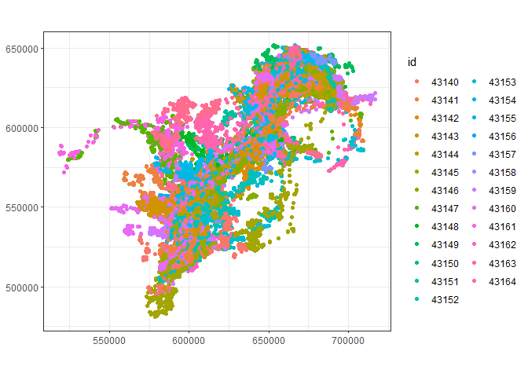

# Home ranges


## Introduction

Objectives:

- Autocorrelated home range estimation
- https://ecoisilva.github.io/AKDE_minireview/code/AKDE_R-tutorial.html

``` r
library(sf)
library(amt)
library(terra)
library(tidyverse)
```

## Make tracks

``` r
gps <- read_csv('../../data/yt/gps.csv') |>
  rename(t_=timestamp,
  x_=longitude, 
  y_=latitude) |>
  mutate(id=paste0('',ID),
  timestamp=NULL, ID=NULL)
glimpse(gps)
```

    Rows: 90,864
    Columns: 5
    $ t_     <dttm> 2020-11-06 19:10:39, 2020-11-07 01:07:00, 2020-11-07 07:05:54,…
    $ x_     <dbl> -129.2876, -129.3327, -129.3022, -129.3021, -129.3146, -129.338…
    $ y_     <dbl> 60.24530, 60.19127, 60.17469, 60.17254, 60.14960, 60.14822, 60.…
    $ season <chr> "earlywinter", "earlywinter", "earlywinter", "earlywinter", "ea…
    $ id     <chr> "43163", "43163", "43163", "43163", "43163", "43163", "43163", …

``` r
trk <- make_track(gps, x_, y_, t_, id = id, season=season, crs = 4326) |>
  transform_coords(crs_to = 3578)
trk
```

    # A tibble: 90,864 × 5
            x_      y_ t_                  id    season     
     *   <dbl>   <dbl> <dttm>              <chr> <chr>      
     1 606014. 563800. 2020-11-03 19:19:10 43161 earlywinter
     2 606921. 564631. 2020-11-03 19:19:11 43147 earlywinter
     3 607072. 564647. 2020-11-03 19:19:15 43146 earlywinter
     4 613483. 568035. 2020-11-04 01:18:15 43144 earlywinter
     5 614729. 567940. 2020-11-04 01:18:22 43159 earlywinter
     6 614729. 567937. 2020-11-04 01:18:37 43141 earlywinter
     7 605307. 565229. 2020-11-04 01:18:38 43158 earlywinter
     8 608083. 564296. 2020-11-04 01:18:39 43164 earlywinter
     9 614007. 569526. 2020-11-04 01:18:40 43147 earlywinter
    10 614018. 569523. 2020-11-04 01:19:24 43146 earlywinter
    # ℹ 90,854 more rows

## All caribou

``` r
ggplot(trk, aes(x = x_, y = y_, color = id, group = id)) +
  geom_point() +
  coord_equal() +
  xlab(NULL) +
  ylab(NULL) +
  theme_bw()
```



## Estimate home ranges

For each caribou, we will estimate their home range using the
autocorrelated kernel density estimator (AKDE) to account for spatial
and temporal autocorrelation. Specifically, we using the hr_akde
function in the `amt` package, which is a convenient wrapper for the
original function in the `ctmmm` package. The code below runs the
estimator for each caribou and save the results to the
“output/home_ranges” folder for use in the subsequent code blocks. It is
commented out since it is slow and only needs to be run once. Note, that
we estimated AKDE for each caribou across all seasons, rather than for
each season. We did this since the intent is to use the HRs to randomly
select available locations from the full home range so that comparisons
to used locations would be comparable.

``` r
# Uncomment to run again
#for (i in unique(trk$id)) {
#  cat("Processing", i, "\n"); flush.console()
#  tr1 <- trk %>% 
#    filter(id %in% c(i))
#  akde <- hr_akde(tr1, model = fit_ctmm(tr1, "ou"), levels = 0.95)
#  saveRDS(akde, paste0("../app/home_ranges/akde_", i, ".RDS"))
#  writeRaster(akde$ud, paste0("../app/home_ranges/akde_", i, ".tif"), overwrite=TRUE)
#}
```

## Viewing the results

Now that we’ve estimated caribou home ranges, we can plot some results.

bnd \<- st_read(‘../../data/yt_caribou.gpkg’, ‘mcp_buff15k’) \|\>
st_transform(4326) bnd \<- vect(bnd) bnd50 \<- buffer(bnd, 50000)

pts \<- sf::st_read(‘../../data/yt_caribou.gpkg’, ‘gps’) \|\>
filter(ID==43163) \|\> st_transform(4326) pts \<- vect(pts)

r=project(akde\$ud, “+proj=longlat +datum=WGS84”)

plet(akde\$ud, “layer”, alpha=.2) \|\> points(pts, col=“gray”, cex=2,
popup=TRUE, clusterOptions = markerClusterOptions())

library(maptiles) bg \<- get_tiles(ext(bnd), provider=opentopomap) bg
\<- crop(bg, bnd50) plotRGB(bg) plot(r, alpha=0.5, add=TRUE) lines(bnd,
col=“blue”, lwd=3) points(pts, pch=20, col=“black”, cex=1)
