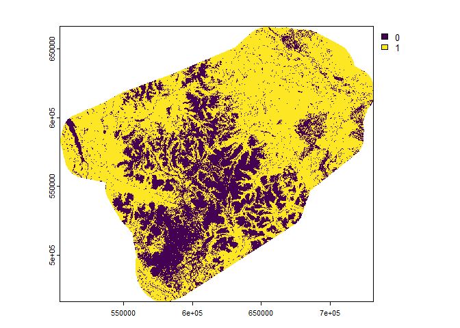
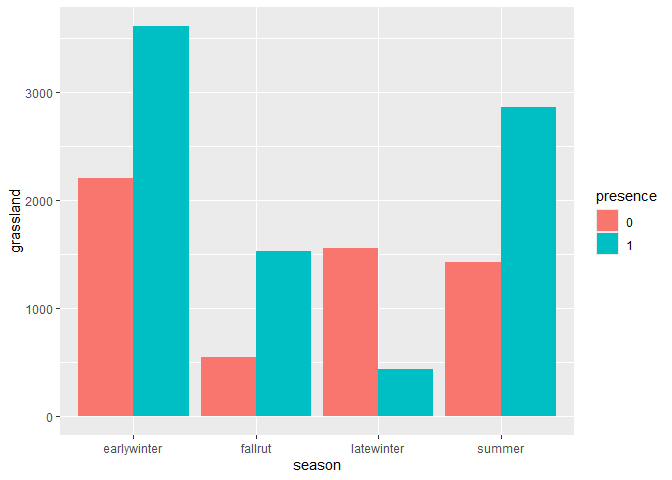
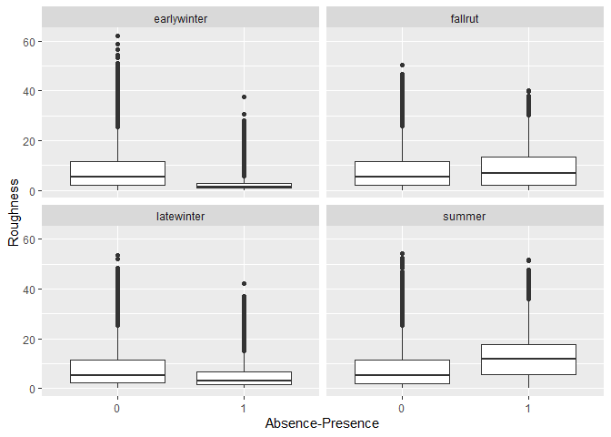

# Predictor variables


# Introduction

Exploratory data analysis on predictor variables.

``` r
gps <- st_read('../../data/yt_caribou.gpkg', 'gps_vars', quiet=TRUE) |>
  st_drop_geometry() |>
  mutate(pa=occurrence, fpa=as.factor(occurrence)) |>
  mutate(occurrence=NULL) |>
  as.data.frame()
landcov <- rast('../../data/raster30/landcov.tif')
topo <- rast('../../data/raster30/topo.tif')
fires <- rast('../../data/raster30/fires.tif')
dist2line <- rast('../../data/raster30/dist2line.tif')
dist2poly <- rast('../../data/raster30/dist2poly.tif')
```

## Categorical predictors

### Forest

``` r
plot(landcov[["forest"]])
```



``` r
gps1=filter(gps, forest==1)
t1=table(gps1$fpa, gps1$season)
#barplot(t1, beside=T, legend.text=T)
t2 <- tibble(season=c("earlywinter","earlywinter","fallrut","fallrut",
  "latewinter","latewinter","summer","summer"), presence=as.factor(c(0,1,0,1,0,1,0,1)),
  forest=as.numeric(t1))
ggplot(t2, aes(x=season, y=forest, fill=presence)) + 
  geom_bar(stat = "identity", position = 'dodge')
```


### Conifer

``` r
plot(landcov[["conifer"]])
```


``` r
gps1=filter(gps, conifer==1)
t1=table(gps1$fpa, gps1$season)
#barplot(t1, beside=T, legend.text=T)
t2 <- tibble(season=c("earlywinter","earlywinter","fallrut","fallrut",
  "latewinter","latewinter","summer","summer"), presence=as.factor(c(0,1,0,1,0,1,0,1)),
  conifer=as.numeric(t1))
ggplot(t2, aes(x=season, y=conifer, fill=presence)) + 
  geom_bar(stat = "identity", position = 'dodge')
```


### Broadleaf

``` r
plot(landcov[["broadleaf"]])
```


``` r
gps1=filter(gps, broadleaf==1)
t1=table(gps1$fpa, gps1$season)
#barplot(t1, beside=T, legend.text=T)
t2 <- tibble(season=c("earlywinter","earlywinter","fallrut","fallrut",
  "latewinter","latewinter","summer","summer"), presence=as.factor(c(0,1,0,1,0,1,0,1)),
  broadleaf=as.numeric(t1))
ggplot(t2, aes(x=season, y=broadleaf, fill=presence)) + 
  geom_bar(stat = "identity", position = 'dodge')
```


### Mixedwood

``` r
plot(landcov[["mixedwood"]])
```


``` r
gps1=filter(gps, mixedwood==1)
t1=table(gps1$fpa, gps1$season)
#barplot(t1, beside=T, legend.text=T)
t2 <- tibble(season=c("earlywinter","earlywinter","fallrut","fallrut",
  "latewinter","latewinter","summer","summer"), presence=as.factor(c(0,1,0,1,0,1,0,1)),
  mixedwood=as.numeric(t1))
ggplot(t2, aes(x=season, y=mixedwood, fill=presence)) + 
  geom_bar(stat = "identity", position = 'dodge')
```


### Wetland

``` r
plot(landcov[["wetland"]])
```


``` r
gps1=filter(gps, wetland==1)
t1=table(gps1$fpa, gps1$season)
#barplot(t1, beside=T, legend.text=T)
t2 <- tibble(season=c("earlywinter","earlywinter","fallrut","fallrut",
  "latewinter","latewinter","summer","summer"), presence=as.factor(c(0,1,0,1,0,1,0,1)),
  wetland=as.numeric(t1))
ggplot(t2, aes(x=season, y=wetland, fill=presence)) + 
  geom_bar(stat = "identity", position = 'dodge')
```


### Shrubland

``` r
plot(landcov[["shrubland"]])
```


``` r
gps1=filter(gps, shrubland==1)
t1=table(gps1$fpa, gps1$season)
#barplot(t1, beside=T, legend.text=T)
t2 <- tibble(season=c("earlywinter","earlywinter","fallrut","fallrut",
  "latewinter","latewinter","summer","summer"), presence=as.factor(c(0,1,0,1,0,1,0,1)),
  shrubland=as.numeric(t1))
ggplot(t2, aes(x=season, y=shrubland, fill=presence)) + 
  geom_bar(stat = "identity", position = 'dodge')
```


### Grassland

``` r
plot(landcov[["grassland"]])
```


``` r
gps1=filter(gps, grassland==1)
t1=table(gps1$fpa, gps1$season)
#barplot(t1, beside=T, legend.text=T)
t2 <- tibble(season=c("earlywinter","earlywinter","fallrut","fallrut",
  "latewinter","latewinter","summer","summer"), presence=as.factor(c(0,1,0,1,0,1,0,1)),
  grassland=as.numeric(t1))
ggplot(t2, aes(x=season, y=grassland, fill=presence)) + 
  geom_bar(stat = "identity", position = 'dodge')
```



### Barren

``` r
plot(landcov[["barren"]])
```


``` r
gps1=filter(gps, barren==1)
t1=table(gps1$fpa, gps1$season)
#barplot(t1, beside=T, legend.text=T)
t2 <- tibble(season=c("earlywinter","earlywinter","fallrut","fallrut",
  "latewinter","latewinter","summer","summer"), presence=as.factor(c(0,1,0,1,0,1,0,1)),
  barren=as.numeric(t1))
ggplot(t2, aes(x=season, y=barren, fill=presence)) + 
  geom_bar(stat = "identity", position = 'dodge')
```


### Snow and Ice

``` r
plot(landcov[["snowice"]])
```


``` r
gps1=filter(gps, snowice==1)
t1=table(gps1$fpa, gps1$season)
#barplot(t1, beside=T, legend.text=T)
t2 <- tibble(season=c("earlywinter","earlywinter","fallrut","fallrut",
  "latewinter","latewinter","summer","summer"), presence=as.factor(c(0,1,0,1,0,1,0,1)),
  snowice=c(0,0,0,0,0,0,as.numeric(t1)))
ggplot(t2, aes(x=season, y=snowice, fill=presence)) + 
  geom_bar(stat = "identity", position = 'dodge')
```


### Fires

``` r
plot(fires)
```


``` r
gps1=filter(gps, fires==1)
t1=table(gps1$fpa, gps1$season)
#barplot(t1, beside=T, legend.text=T)
t2 <- tibble(season=c("earlywinter","earlywinter","fallrut","fallrut",
  "latewinter","latewinter","summer","summer"), presence=as.factor(c(0,1,0,1,0,1,0,1)),
  fires=as.numeric(t1))
ggplot(t2, aes(x=season, y=fires, fill=presence)) + 
  geom_bar(stat = "identity", position = 'dodge')
```


## Continuous predictors

**Correlation matrix**

Let’s start by looking at a correlation matrix of our continuous
predictors.

``` r
M=cor(gps[c(12:17,19:20)])
corrplot::corrplot(M, method='number')
```


### Distance to linear disturbance

``` r
plot(dist2line)
```


``` r
ggplot(data=gps, aes(x=fpa, y=dist2line)) +
  geom_boxplot() +
  xlab("Absence-Presence") +
  ylab("Distance to line") +
  facet_wrap(~season)
```


### Distance to areal disturbance

``` r
plot(dist2poly)
```


``` r
ggplot(data=gps, aes(x=fpa, y=dist2poly)) +
  geom_boxplot() +
  xlab("Absence-Presence") +
  ylab("Distance to polygon") +
  facet_wrap(~season)
```


### Elevation

``` r
plot(topo[['elevation']])
```


``` r
#dem=topo[['elevation']]
#elevation_matrix <- raster_to_matrix(dem)
#elevation_matrix %>%
#  sphere_shade(texture = "desert") %>%
#  plot_map()
```

``` r
ggplot(data=gps, aes(x=fpa, y=elevation)) +
  geom_boxplot() +
  xlab("Absence-Presence") +
  ylab("Elevation") +
  facet_wrap(~season)
```


### Aspect

``` r
plot(topo[['aspect']])
```


``` r
ggplot(data=gps, aes(x=fpa, y=aspect)) +
  geom_boxplot() +
  xlab("Absence-Presence") +
  ylab("Aspect") +
  facet_wrap(~season)
```


### Slope

``` r
plot(topo[['slope']])
```


``` r
ggplot(data=gps, aes(x=fpa, y=slope)) +
  geom_boxplot() +
  xlab("Absence-Presence") +
  ylab("Slope") +
  facet_wrap(~season)
```


### Roughness

The correlation between slope and roughness is 0.99, so there is no
sense in keeping both.

``` r
plot(topo[['roughness']])
```


``` r
ggplot(data=gps, aes(x=fpa, y=roughness)) +
  geom_boxplot() +
  xlab("Absence-Presence") +
  ylab("Roughness") +
  facet_wrap(~season)
```



### Eastness

``` r
plot(topo[['eastness']])
```


``` r
ggplot(data=gps, aes(x=fpa, y=eastness)) +
  geom_boxplot() +
  xlab("Absence-Presence") +
  ylab("Eastness") +
  facet_wrap(~season)
```


### Northness

``` r
plot(topo[['northness']])
```


``` r
ggplot(data=gps, aes(x=fpa, y=northness)) +
  geom_boxplot() +
  xlab("Absence-Presence") +
  ylab("northness") +
  facet_wrap(~season)
```


