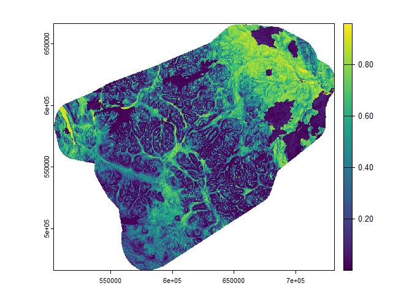
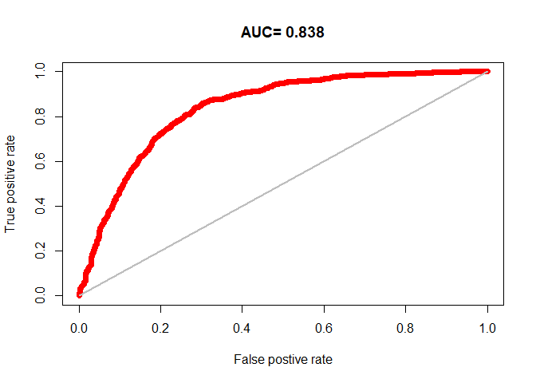
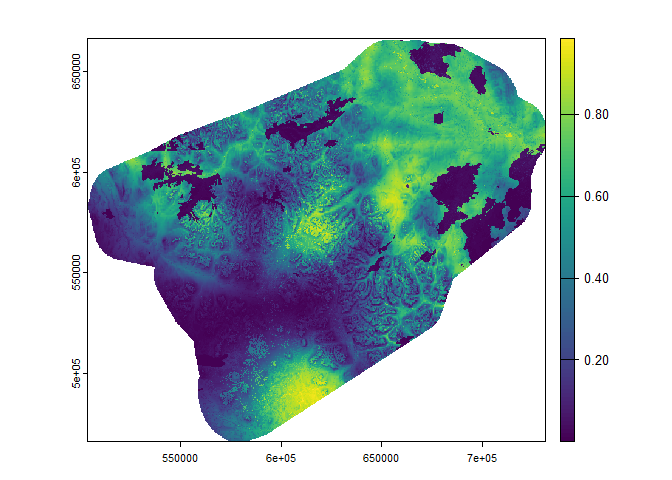
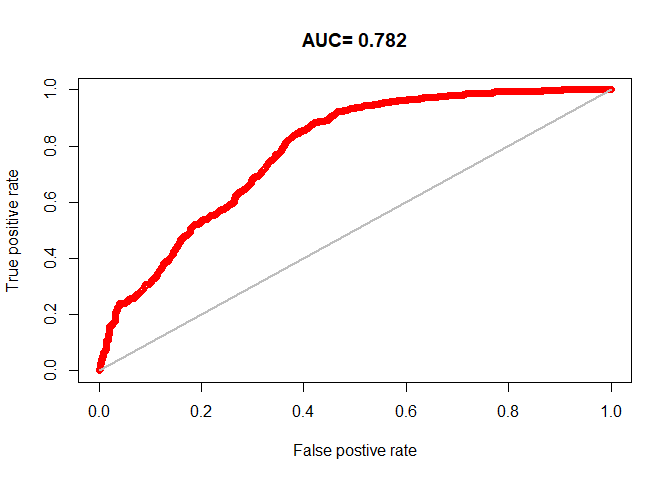
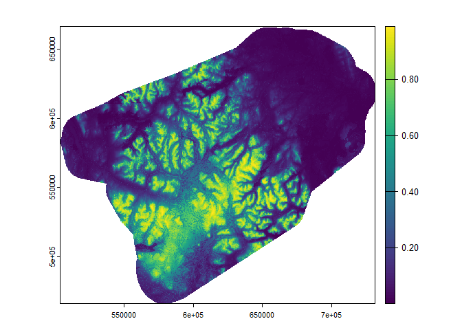
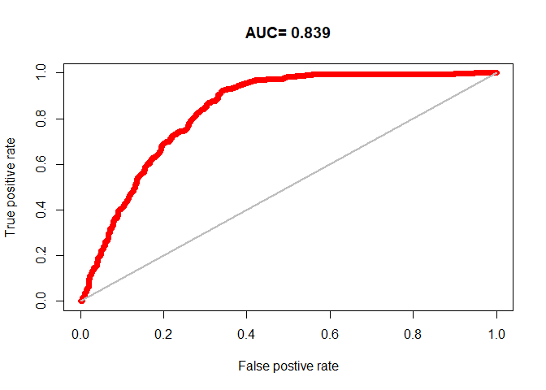
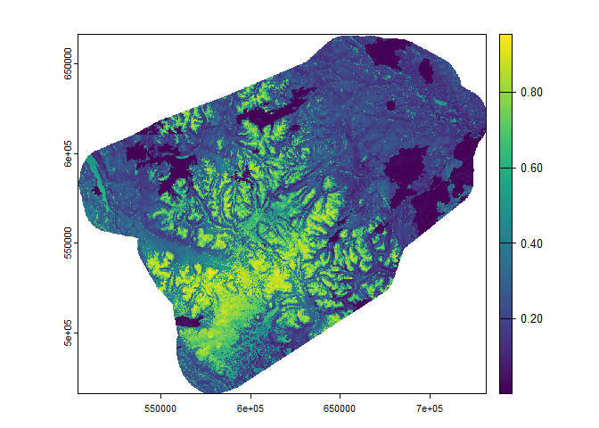
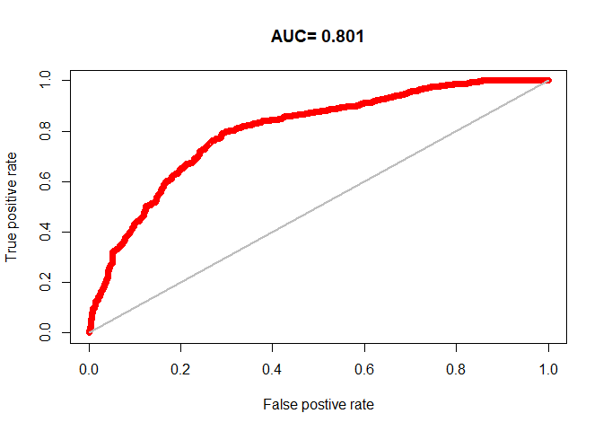

# Generalized linear models


## Introduction

Generalized linear models…

Read rasters that will be needed for generating prediction maps.

``` r
#Select a season or comment out line 20
seasons <- c('earlywinter', 'latewinter', 'summer', 'fallrut')
i <- seasons[1]
nsize = 10000
landcov <- rast('../../data/raster30/landcov.tif')
topo <- rast('../../data/raster30/topo.tif')
fires <- rast('../../data/raster30/fires.tif')
dist2line <- rast('../../data/raster30/dist2line.tif')
names(dist2line) <- "dist2line"
dist2poly <- rast('../../data/raster30/dist2poly.tif')
names(dist2poly) <- "dist2poly"
rasters <- c(landcov, topo, fires, dist2line, dist2poly)
names(rasters)
```

     [1] "forest"    "conifer"   "broadleaf" "mixedwood" "wetland"   "shrubland"
     [7] "grassland" "barren"    "snowice"   "elevation" "slope"     "aspect"   
    [13] "roughness" "northness" "eastness"  "fires"     "dist2line" "dist2poly"

## Run models for each season

``` r
for (sea in seasons) {
  cat('Processing', sea, '...\n'); flush.console()
  
  # Prepare data
  gps <- st_read('../../data/yt_caribou.gpkg', 'gps_vars', quiet=TRUE) |>
    st_drop_geometry() |>
    filter(season==sea) |>
    mutate(pa=occurrence, fpa=as.factor(occurrence)) |>
    mutate(occurrence=NULL) |>
    sample_n(nsize) |>
    as.data.frame()

  covars <- names(gps[,3:20])

  # Split data into training and test sets
  i <- sample(nrow(gps), 0.2 * nrow(gps))
  test <- gps[i,]
  train <- gps[-i,]

  # Estimate GLM model
  m1 <- glm(pa ~ scale(elevation) + scale(aspect) + scale(roughness) + scale(eastness) +
            scale(northness) + scale(dist2line) + scale(dist2poly) + fires +
            forest + barren, family=binomial, data=train)
  print(summary(m1))
  print(report(m1))

  # Predict
  p1 <- predict(rasters, m1, type='response', na.rm=T)
  png(paste0('../../output/glm/',sea,'_map.png'))
  plot(p1)
  dev.off()
  plot(p1)
  writeRaster(p1, paste0("../../data/predict30/randomforest/",sea,"map.tif"), overwrite=TRUE)

  # Evaluate model
  eva <- predicts::pa_evaluate(predict(m1, test[test$pa==1, ]), predict(m1, test[test$pa==0, ]))
  png(paste0('../../output/glm/',sea,'_auc.png'))
  plot(eva, "ROC")
  dev.off()
  plot(eva, "ROC")
  print(eva)
}
```

    Processing earlywinter ...

    Call:
    glm(formula = pa ~ scale(elevation) + scale(aspect) + scale(roughness) + 
        scale(eastness) + scale(northness) + scale(dist2line) + scale(dist2poly) + 
        fires + forest + barren, family = binomial, data = train)

    Coefficients:
                     Estimate Std. Error z value Pr(>|z|)    
    (Intercept)       0.51160    0.07526   6.798 1.06e-11 ***
    scale(elevation) -0.32169    0.05390  -5.969 2.39e-09 ***
    scale(aspect)    -0.04522    0.04418  -1.023 0.306074    
    scale(roughness) -1.41509    0.06246 -22.654  < 2e-16 ***
    scale(eastness)  -0.09437    0.04404  -2.143 0.032136 *  
    scale(northness)  0.19150    0.02748   6.969 3.20e-12 ***
    scale(dist2line)  0.03967    0.06222   0.638 0.523707    
    scale(dist2poly) -0.46742    0.06913  -6.762 1.37e-11 ***
    fires            -4.38478    0.31404 -13.962  < 2e-16 ***
    forest           -0.89289    0.08730 -10.228  < 2e-16 ***
    barren            0.41161    0.11629   3.540 0.000401 ***
    ---
    Signif. codes:  0 '***' 0.001 '**' 0.01 '*' 0.05 '.' 0.1 ' ' 1

    (Dispersion parameter for binomial family taken to be 1)

        Null deviance: 11090.2  on 7999  degrees of freedom
    Residual deviance:  8123.9  on 7989  degrees of freedom
    AIC: 8145.9

    Number of Fisher Scoring iterations: 6

    We fitted a logistic model (estimated using ML) to predict pa with elevation,
    aspect, roughness, eastness, northness, dist2line, dist2poly, fires, forest and
    barren (formula: pa ~ scale(elevation) + scale(aspect) + scale(roughness) +
    scale(eastness) + scale(northness) + scale(dist2line) + scale(dist2poly) +
    fires + forest + barren). The model's explanatory power is substantial (Tjur's
    R2 = 0.33). The model's intercept, corresponding to elevation = 0, aspect = 0,
    roughness = 0, eastness = 0, northness = 0, dist2line = 0, dist2poly = 0, fires
    = 0, forest = 0 and barren = 0, is at 0.51 (95% CI [0.36, 0.66], p < .001).
    Within this model:

      - The effect of elevation is statistically significant and negative (beta =
    -0.32, 95% CI [-0.43, -0.22], p < .001; Std. beta = -0.32, 95% CI [-0.43,
    -0.22])
      - The effect of aspect is statistically non-significant and negative (beta =
    -0.05, 95% CI [-0.13, 0.04], p = 0.306; Std. beta = -0.05, 95% CI [-0.13,
    0.04])
      - The effect of roughness is statistically significant and negative (beta =
    -1.42, 95% CI [-1.54, -1.29], p < .001; Std. beta = -1.42, 95% CI [-1.54,
    -1.29])
      - The effect of eastness is statistically significant and negative (beta =
    -0.09, 95% CI [-0.18, -8.09e-03], p = 0.032; Std. beta = -0.09, 95% CI [-0.18,
    -8.09e-03])
      - The effect of northness is statistically significant and positive (beta =
    0.19, 95% CI [0.14, 0.25], p < .001; Std. beta = 0.19, 95% CI [0.14, 0.25])
      - The effect of dist2line is statistically non-significant and positive (beta =
    0.04, 95% CI [-0.08, 0.16], p = 0.524; Std. beta = 0.04, 95% CI [-0.08, 0.16])
      - The effect of dist2poly is statistically significant and negative (beta =
    -0.47, 95% CI [-0.60, -0.33], p < .001; Std. beta = -0.47, 95% CI [-0.60,
    -0.33])
      - The effect of fires is statistically significant and negative (beta = -4.38,
    95% CI [-5.06, -3.82], p < .001; Std. beta = -0.94, 95% CI [-1.09, -0.82])
      - The effect of forest is statistically significant and negative (beta = -0.89,
    95% CI [-1.06, -0.72], p < .001; Std. beta = -0.41, 95% CI [-0.49, -0.33])
      - The effect of barren is statistically significant and positive (beta = 0.41,
    95% CI [0.18, 0.64], p < .001; Std. beta = 0.13, 95% CI [0.06, 0.20])

    Standardized parameters were obtained by fitting the model on a standardized
    version of the dataset. 95% Confidence Intervals (CIs) and p-values were
    computed using a Wald z-distribution approximation.

    |---------|---------|---------|---------|
    =========================================
                                              



    @stats
        np  na prevalence   auc   cor pcor   ODP
    1 1006 994      0.503 0.838 0.543    0 0.497

    @thresholds
      max_kappa max_spec_sens no_omission equal_prevalence equal_sens_spec
    1    -0.053        -0.053       -5.05            0.503           0.327

    @tr_stats
         treshold kappa CCR TPR TNR FPR FNR PPP NPP MCR  OR
    1       -9.31     0 0.5   1   0   1   0 0.5 NaN 0.5 NaN
    2        -9.1     0 0.5   1   0   1   0 0.5   1 0.5 Inf
    3       -8.89     0 0.5   1   0   1   0 0.5   1 0.5 Inf
    4         ...   ... ... ... ... ... ... ... ... ... ...
    1995     2.83     0 0.5   0   1   0   1   1 0.5 0.5 Inf
    1996     2.83     0 0.5   0   1   0   1 NaN 0.5 0.5 NaN
    1997     2.83     0 0.5   0   1   0   1 NaN 0.5 0.5 NaN
    Processing latewinter ...

    Call:
    glm(formula = pa ~ scale(elevation) + scale(aspect) + scale(roughness) + 
        scale(eastness) + scale(northness) + scale(dist2line) + scale(dist2poly) + 
        fires + forest + barren, family = binomial, data = train)

    Coefficients:
                     Estimate Std. Error z value Pr(>|z|)    
    (Intercept)      -0.43598    0.07923  -5.503 3.74e-08 ***
    scale(elevation) -0.46514    0.04783  -9.725  < 2e-16 ***
    scale(aspect)    -0.01028    0.04387  -0.234   0.8148    
    scale(roughness) -0.35649    0.03763  -9.473  < 2e-16 ***
    scale(eastness)  -0.04873    0.04416  -1.103   0.2698    
    scale(northness)  0.06058    0.02629   2.304   0.0212 *  
    scale(dist2line) -1.78533    0.06196 -28.813  < 2e-16 ***
    scale(dist2poly)  1.19313    0.05772  20.670  < 2e-16 ***
    fires            -4.14433    0.34211 -12.114  < 2e-16 ***
    forest            0.44037    0.08972   4.908 9.20e-07 ***
    barren            1.45798    0.11351  12.845  < 2e-16 ***
    ---
    Signif. codes:  0 '***' 0.001 '**' 0.01 '*' 0.05 '.' 0.1 ' ' 1

    (Dispersion parameter for binomial family taken to be 1)

        Null deviance: 11089.6  on 7999  degrees of freedom
    Residual deviance:  8651.2  on 7989  degrees of freedom
    AIC: 8673.2

    Number of Fisher Scoring iterations: 6

    We fitted a logistic model (estimated using ML) to predict pa with elevation,
    aspect, roughness, eastness, northness, dist2line, dist2poly, fires, forest and
    barren (formula: pa ~ scale(elevation) + scale(aspect) + scale(roughness) +
    scale(eastness) + scale(northness) + scale(dist2line) + scale(dist2poly) +
    fires + forest + barren). The model's explanatory power is substantial (Tjur's
    R2 = 0.27). The model's intercept, corresponding to elevation = 0, aspect = 0,
    roughness = 0, eastness = 0, northness = 0, dist2line = 0, dist2poly = 0, fires
    = 0, forest = 0 and barren = 0, is at -0.44 (95% CI [-0.59, -0.28], p < .001).
    Within this model:

      - The effect of elevation is statistically significant and negative (beta =
    -0.47, 95% CI [-0.56, -0.37], p < .001; Std. beta = -0.47, 95% CI [-0.56,
    -0.37])
      - The effect of aspect is statistically non-significant and negative (beta =
    -0.01, 95% CI [-0.10, 0.08], p = 0.815; Std. beta = -0.01, 95% CI [-0.10,
    0.08])
      - The effect of roughness is statistically significant and negative (beta =
    -0.36, 95% CI [-0.43, -0.28], p < .001; Std. beta = -0.36, 95% CI [-0.43,
    -0.28])
      - The effect of eastness is statistically non-significant and negative (beta =
    -0.05, 95% CI [-0.14, 0.04], p = 0.270; Std. beta = -0.05, 95% CI [-0.14,
    0.04])
      - The effect of northness is statistically significant and positive (beta =
    0.06, 95% CI [9.04e-03, 0.11], p = 0.021; Std. beta = 0.06, 95% CI [9.04e-03,
    0.11])
      - The effect of dist2line is statistically significant and negative (beta =
    -1.79, 95% CI [-1.91, -1.67], p < .001; Std. beta = -1.79, 95% CI [-1.91,
    -1.67])
      - The effect of dist2poly is statistically significant and positive (beta =
    1.19, 95% CI [1.08, 1.31], p < .001; Std. beta = 1.19, 95% CI [1.08, 1.31])
      - The effect of fires is statistically significant and negative (beta = -4.14,
    95% CI [-4.89, -3.53], p < .001; Std. beta = -0.90, 95% CI [-1.06, -0.77])
      - The effect of forest is statistically significant and positive (beta = 0.44,
    95% CI [0.26, 0.62], p < .001; Std. beta = 0.20, 95% CI [0.12, 0.27])
      - The effect of barren is statistically significant and positive (beta = 1.46,
    95% CI [1.24, 1.68], p < .001; Std. beta = 0.49, 95% CI [0.41, 0.56])

    Standardized parameters were obtained by fitting the model on a standardized
    version of the dataset. 95% Confidence Intervals (CIs) and p-values were
    computed using a Wald z-distribution approximation.

    |---------|---------|---------|---------|
    =========================================
                                              





    @stats
        np  na prevalence   auc   cor pcor   ODP
    1 1003 997      0.501 0.782 0.494    0 0.498

    @thresholds
      max_kappa max_spec_sens no_omission equal_prevalence equal_sens_spec
    1    -0.381        -0.381      -3.731              0.5            0.19

    @tr_stats
         treshold kappa CCR TPR TNR FPR FNR PPP NPP MCR  OR
    1       -7.05     0 0.5   1   0   1   0 0.5 NaN 0.5 NaN
    2       -6.96     0 0.5   1   0   1   0 0.5   1 0.5 Inf
    3       -6.96     0 0.5   1   0   1   0 0.5   1 0.5 Inf
    4         ...   ... ... ... ... ... ... ... ... ... ...
    1997     2.52     0 0.5   0   1   0   1   1 0.5 0.5 Inf
    1998     2.52     0 0.5   0   1   0   1   1 0.5 0.5 Inf
    1999     2.52     0 0.5   0   1   0   1 NaN 0.5 0.5 NaN
    Processing summer ...

    Call:
    glm(formula = pa ~ scale(elevation) + scale(aspect) + scale(roughness) + 
        scale(eastness) + scale(northness) + scale(dist2line) + scale(dist2poly) + 
        fires + forest + barren, family = binomial, data = train)

    Coefficients:
                     Estimate Std. Error z value Pr(>|z|)    
    (Intercept)       0.26820    0.05733   4.678 2.89e-06 ***
    scale(elevation)  1.79035    0.06547  27.347  < 2e-16 ***
    scale(aspect)    -0.11879    0.04820  -2.464 0.013726 *  
    scale(roughness) -0.18739    0.03566  -5.255 1.48e-07 ***
    scale(eastness)  -0.18487    0.04804  -3.848 0.000119 ***
    scale(northness)  0.08827    0.02925   3.018 0.002543 ** 
    scale(dist2line)  0.75706    0.05720  13.236  < 2e-16 ***
    scale(dist2poly) -0.47721    0.05976  -7.986 1.39e-15 ***
    fires            -1.22586    0.25341  -4.837 1.31e-06 ***
    forest           -0.77561    0.07601 -10.203  < 2e-16 ***
    barren           -0.48107    0.08422  -5.712 1.12e-08 ***
    ---
    Signif. codes:  0 '***' 0.001 '**' 0.01 '*' 0.05 '.' 0.1 ' ' 1

    (Dispersion parameter for binomial family taken to be 1)

        Null deviance: 11088.0  on 7999  degrees of freedom
    Residual deviance:  7331.5  on 7989  degrees of freedom
    AIC: 7353.5

    Number of Fisher Scoring iterations: 6

    We fitted a logistic model (estimated using ML) to predict pa with elevation,
    aspect, roughness, eastness, northness, dist2line, dist2poly, fires, forest and
    barren (formula: pa ~ scale(elevation) + scale(aspect) + scale(roughness) +
    scale(eastness) + scale(northness) + scale(dist2line) + scale(dist2poly) +
    fires + forest + barren). The model's explanatory power is substantial (Tjur's
    R2 = 0.40). The model's intercept, corresponding to elevation = 0, aspect = 0,
    roughness = 0, eastness = 0, northness = 0, dist2line = 0, dist2poly = 0, fires
    = 0, forest = 0 and barren = 0, is at 0.27 (95% CI [0.16, 0.38], p < .001).
    Within this model:

      - The effect of elevation is statistically significant and positive (beta =
    1.79, 95% CI [1.66, 1.92], p < .001; Std. beta = 1.79, 95% CI [1.66, 1.92])
      - The effect of aspect is statistically significant and negative (beta = -0.12,
    95% CI [-0.21, -0.02], p = 0.014; Std. beta = -0.12, 95% CI [-0.21, -0.02])
      - The effect of roughness is statistically significant and negative (beta =
    -0.19, 95% CI [-0.26, -0.12], p < .001; Std. beta = -0.19, 95% CI [-0.26,
    -0.12])
      - The effect of eastness is statistically significant and negative (beta =
    -0.18, 95% CI [-0.28, -0.09], p < .001; Std. beta = -0.18, 95% CI [-0.28,
    -0.09])
      - The effect of northness is statistically significant and positive (beta =
    0.09, 95% CI [0.03, 0.15], p = 0.003; Std. beta = 0.09, 95% CI [0.03, 0.15])
      - The effect of dist2line is statistically significant and positive (beta =
    0.76, 95% CI [0.65, 0.87], p < .001; Std. beta = 0.76, 95% CI [0.65, 0.87])
      - The effect of dist2poly is statistically significant and negative (beta =
    -0.48, 95% CI [-0.59, -0.36], p < .001; Std. beta = -0.48, 95% CI [-0.59,
    -0.36])
      - The effect of fires is statistically significant and negative (beta = -1.23,
    95% CI [-1.75, -0.75], p < .001; Std. beta = -0.28, 95% CI [-0.40, -0.17])
      - The effect of forest is statistically significant and negative (beta = -0.78,
    95% CI [-0.92, -0.63], p < .001; Std. beta = -0.38, 95% CI [-0.46, -0.31])
      - The effect of barren is statistically significant and negative (beta = -0.48,
    95% CI [-0.65, -0.32], p < .001; Std. beta = -0.23, 95% CI [-0.30, -0.15])

    Standardized parameters were obtained by fitting the model on a standardized
    version of the dataset. 95% Confidence Intervals (CIs) and p-values were
    computed using a Wald z-distribution approximation.

    |---------|---------|---------|---------|
    =========================================
                                              





    @stats
       np   na prevalence   auc   cor pcor   ODP
    1 998 1002      0.499 0.839 0.594    0 0.501

    @thresholds
      max_kappa max_spec_sens no_omission equal_prevalence equal_sens_spec
    1    -0.525        -0.525       -4.48            0.499           0.201

    @tr_stats
         treshold kappa CCR TPR TNR FPR FNR PPP NPP MCR  OR
    1       -6.06     0 0.5   1   0   1   0 0.5 NaN 0.5 NaN
    2       -5.84     0 0.5   1   0   1   0 0.5   1 0.5 Inf
    3       -5.73     0 0.5   1   0   1   0 0.5   1 0.5 Inf
    4         ...   ... ... ... ... ... ... ... ... ... ...
    1993     4.26     0 0.5   0   1   0   1   1 0.5 0.5 Inf
    1994     4.26     0 0.5   0   1   0   1 NaN 0.5 0.5 NaN
    1995     4.26     0 0.5   0   1   0   1 NaN 0.5 0.5 NaN
    Processing fallrut ...

    Call:
    glm(formula = pa ~ scale(elevation) + scale(aspect) + scale(roughness) + 
        scale(eastness) + scale(northness) + scale(dist2line) + scale(dist2poly) + 
        fires + forest + barren, family = binomial, data = train)

    Coefficients:
                     Estimate Std. Error z value Pr(>|z|)    
    (Intercept)       0.61345    0.05164  11.879  < 2e-16 ***
    scale(elevation)  0.51088    0.04861  10.509  < 2e-16 ***
    scale(aspect)     0.01151    0.04511   0.255    0.799    
    scale(roughness) -0.42966    0.03485 -12.330  < 2e-16 ***
    scale(eastness)   0.03765    0.04488   0.839    0.402    
    scale(northness)  0.18847    0.02757   6.837 8.10e-12 ***
    scale(dist2line)  0.66682    0.05748  11.601  < 2e-16 ***
    scale(dist2poly) -0.43559    0.06102  -7.138 9.46e-13 ***
    fires            -3.85894    0.45670  -8.450  < 2e-16 ***
    forest           -1.51645    0.07605 -19.941  < 2e-16 ***
    barren            0.36681    0.07721   4.751 2.02e-06 ***
    ---
    Signif. codes:  0 '***' 0.001 '**' 0.01 '*' 0.05 '.' 0.1 ' ' 1

    (Dispersion parameter for binomial family taken to be 1)

        Null deviance: 11090  on 7999  degrees of freedom
    Residual deviance:  8202  on 7989  degrees of freedom
    AIC: 8224

    Number of Fisher Scoring iterations: 7

    We fitted a logistic model (estimated using ML) to predict pa with elevation,
    aspect, roughness, eastness, northness, dist2line, dist2poly, fires, forest and
    barren (formula: pa ~ scale(elevation) + scale(aspect) + scale(roughness) +
    scale(eastness) + scale(northness) + scale(dist2line) + scale(dist2poly) +
    fires + forest + barren). The model's explanatory power is substantial (Tjur's
    R2 = 0.32). The model's intercept, corresponding to elevation = 0, aspect = 0,
    roughness = 0, eastness = 0, northness = 0, dist2line = 0, dist2poly = 0, fires
    = 0, forest = 0 and barren = 0, is at 0.61 (95% CI [0.51, 0.72], p < .001).
    Within this model:

      - The effect of elevation is statistically significant and positive (beta =
    0.51, 95% CI [0.42, 0.61], p < .001; Std. beta = 0.51, 95% CI [0.42, 0.61])
      - The effect of aspect is statistically non-significant and positive (beta =
    0.01, 95% CI [-0.08, 0.10], p = 0.799; Std. beta = 0.01, 95% CI [-0.08, 0.10])
      - The effect of roughness is statistically significant and negative (beta =
    -0.43, 95% CI [-0.50, -0.36], p < .001; Std. beta = -0.43, 95% CI [-0.50,
    -0.36])
      - The effect of eastness is statistically non-significant and positive (beta =
    0.04, 95% CI [-0.05, 0.13], p = 0.402; Std. beta = 0.04, 95% CI [-0.05, 0.13])
      - The effect of northness is statistically significant and positive (beta =
    0.19, 95% CI [0.13, 0.24], p < .001; Std. beta = 0.19, 95% CI [0.13, 0.24])
      - The effect of dist2line is statistically significant and positive (beta =
    0.67, 95% CI [0.55, 0.78], p < .001; Std. beta = 0.67, 95% CI [0.55, 0.78])
      - The effect of dist2poly is statistically significant and negative (beta =
    -0.44, 95% CI [-0.56, -0.32], p < .001; Std. beta = -0.44, 95% CI [-0.56,
    -0.32])
      - The effect of fires is statistically significant and negative (beta = -3.86,
    95% CI [-4.90, -3.07], p < .001; Std. beta = -0.83, 95% CI [-1.05, -0.66])
      - The effect of forest is statistically significant and negative (beta = -1.52,
    95% CI [-1.67, -1.37], p < .001; Std. beta = -0.75, 95% CI [-0.82, -0.68])
      - The effect of barren is statistically significant and positive (beta = 0.37,
    95% CI [0.22, 0.52], p < .001; Std. beta = 0.17, 95% CI [0.10, 0.24])

    Standardized parameters were obtained by fitting the model on a standardized
    version of the dataset. 95% Confidence Intervals (CIs) and p-values were
    computed using a Wald z-distribution approximation.

    |---------|---------|---------|---------|
    =========================================
                                              







    @stats
        np  na prevalence   auc   cor pcor   ODP
    1 1004 996      0.502 0.801 0.509    0 0.498

    @thresholds
      max_kappa max_spec_sens no_omission equal_prevalence equal_sens_spec
    1    -0.002        -0.002      -1.866            0.501           0.273

    @tr_stats
         treshold kappa CCR TPR TNR FPR FNR PPP NPP MCR  OR
    1        -6.1     0 0.5   1   0   1   0 0.5 NaN 0.5 NaN
    2        -5.9     0 0.5   1   0   1   0 0.5   1 0.5 Inf
    3       -5.88     0 0.5   1   0   1   0 0.5   1 0.5 Inf
    4         ...   ... ... ... ... ... ... ... ... ... ...
    1996     2.58     0 0.5   0   1   0   1   0 0.5 0.5   0
    1997     2.58     0 0.5   0   1   0   1 NaN 0.5 0.5 NaN
    1998     2.58     0 0.5   0   1   0   1 NaN 0.5 0.5 NaN
