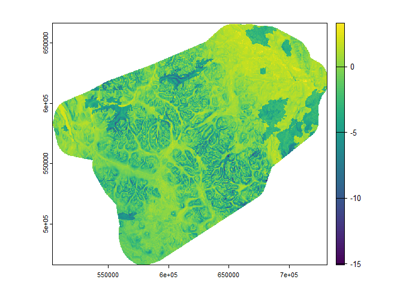
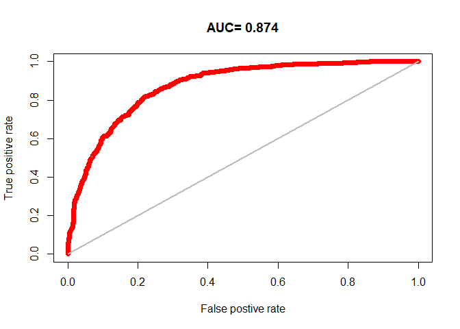
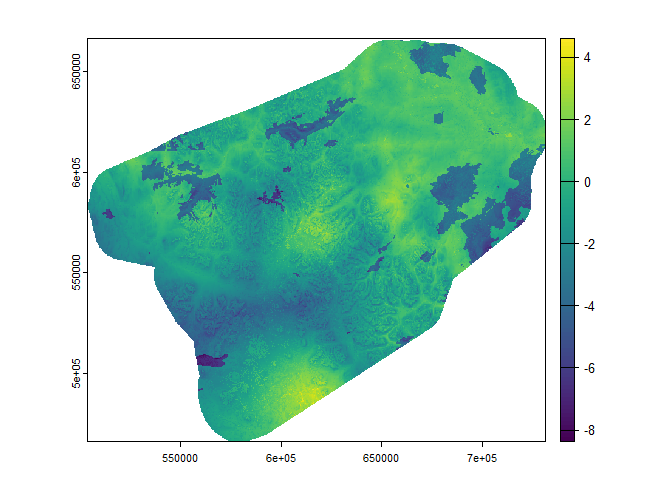
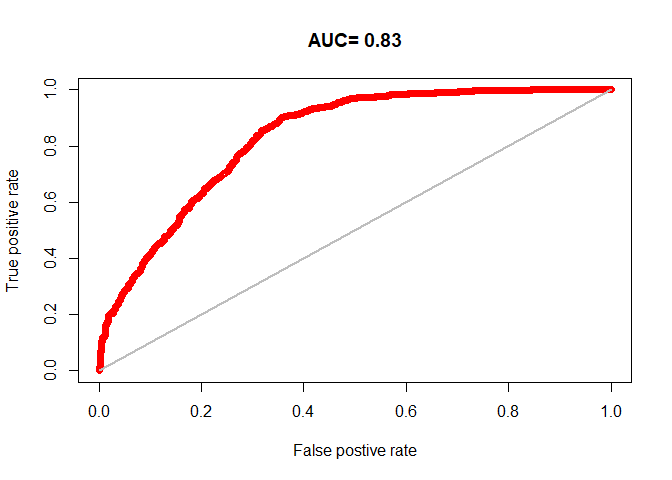
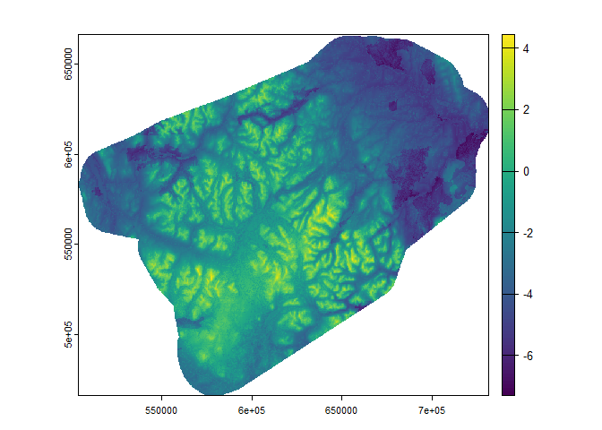
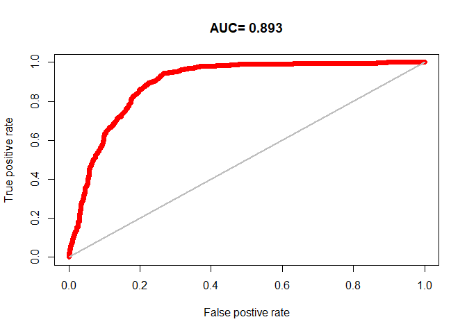
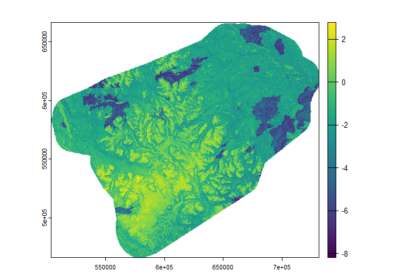
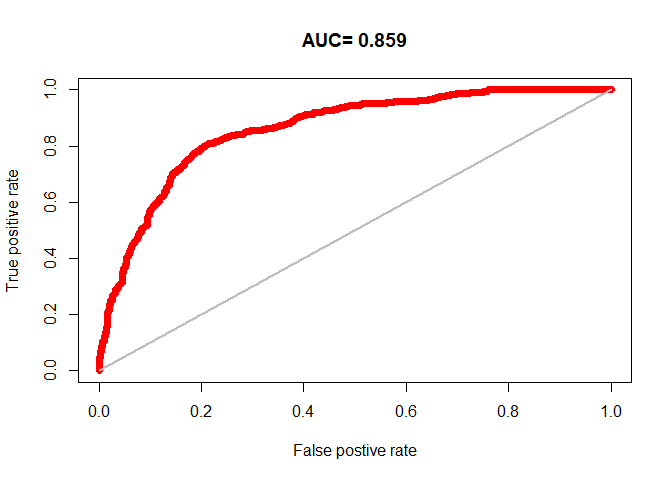

# Generalized linear mixed models


## Introduction

Generalized linear mixed models…

Read rasters that will be needed for generating prediction maps.

``` r
#Select a season or comment out line 20
seasons <- c('earlywinter', 'latewinter', 'summer', 'fallrut')
i <- seasons[1]
nsize = 10000
landcov <- rast('../../data/raster30/landcov.tif')
topo <- rast('../../data/raster30/topo.tif')
fires <- rast('../../data/raster30/fires.tif')
dist2line <- rast('../../data/raster30/dist2line.tif')
names(dist2line) <- "dist2line"
dist2poly <- rast('../../data/raster30/dist2poly.tif')
names(dist2poly) <- "dist2poly"
rasters <- c(landcov, topo, fires, dist2line, dist2poly)
names(rasters)
```

     [1] "forest"    "conifer"   "broadleaf" "mixedwood" "wetland"   "shrubland"
     [7] "grassland" "barren"    "snowice"   "elevation" "slope"     "aspect"   
    [13] "roughness" "northness" "eastness"  "fires"     "dist2line" "dist2poly"

## Run models for each season

``` r
for (sea in seasons) {
  cat('Processing', sea, '...\n'); flush.console()

  # Prepare data
  gps <- st_read('../../data/yt_caribou.gpkg', 'gps_vars') |>
    st_drop_geometry() |>
    filter(season==sea) |>
    mutate(pa=occurrence, fpa=as.factor(occurrence)) |>
    mutate(occurrence=NULL) |>
    sample_n(nsize) |>
    as.data.frame()

  covars <- names(gps[,3:20])

  # Split data into training and test sets
  i <- sample(nrow(gps), 0.2 * nrow(gps))
  test <- gps[i,]
  train <- gps[-i,]

  # Estimate GLM model
  #m1 <- glm(pa ~ elevation + aspect + roughness + eastness + northness + footprint500m +
  #          distance2foot + fires + forest + barren, family=binomial, data=train)
  m1 <- glmer(pa ~ scale(elevation) + scale(aspect) + scale(roughness) + scale(eastness) +
            scale(northness) + scale(dist2line) + scale(dist2poly) + fires +
            forest + barren + (1|individual), family=binomial, data=train)
  print(summary(m1))
  print(report(m1))
  
  # Predict
  # https://optimumsportsperformance.com/blog/making-predictions-from-a-mixed-model-using-r/
  #p1 <- terra::predict(rasters, m1, const=data.frame(individual=NA), re.form=NA)
  p1 <- terra::predict(rasters, m1, re.form=NA)
  png(paste0('../../output/glmm/',sea,'_map.png'))
  plot(p1)
  dev.off()
  plot(p1)
  writeRaster(p1, paste0("../../data/predict30/randomforest/",sea,"map.tif"), overwrite=TRUE)

  # Evaluate model
  eva <- predicts::pa_evaluate(predict(m1, test[test$pa==1, ]), predict(m1, test[test$pa==0, ]))
  png(paste0('../../output/glmm/',sea,'_auc.png'))
  plot(eva, "ROC")
  dev.off()
  plot(eva, "ROC")
  print(eva)
}
```

    Processing earlywinter ...
    Reading layer `gps_vars' from data source 
      `C:\Users\PIVER37\Desktop\Projects\little_rancheria\data\yt_caribou.gpkg' 
      using driver `GPKG'
    Simple feature collection with 154182 features and 21 fields
    Geometry type: POINT
    Dimension:     XY
    Bounding box:  xmin: 503895 ymin: 466005 xmax: 731595 ymax: 666405
    Projected CRS: NAD83 / Yukon Albers
    Generalized linear mixed model fit by maximum likelihood (Laplace
      Approximation) [glmerMod]
     Family: binomial  ( logit )
    Formula: 
    pa ~ scale(elevation) + scale(aspect) + scale(roughness) + scale(eastness) +  
        scale(northness) + scale(dist2line) + scale(dist2poly) +  
        fires + forest + barren + (1 | individual)
       Data: train

         AIC      BIC   logLik deviance df.resid 
      7418.3   7502.2  -3697.2   7394.3     7988 

    Scaled residuals: 
        Min      1Q  Median      3Q     Max 
    -8.7723 -0.5350 -0.0121  0.5708 21.8798 

    Random effects:
     Groups     Name        Variance Std.Dev.
     individual (Intercept) 0.9278   0.9632  
    Number of obs: 8000, groups:  individual, 25

    Fixed effects:
                     Estimate Std. Error z value Pr(>|z|)    
    (Intercept)       0.42524    0.20872   2.037   0.0416 *  
    scale(elevation) -0.36919    0.05795  -6.370 1.88e-10 ***
    scale(aspect)    -0.01281    0.04680  -0.274   0.7842    
    scale(roughness) -1.42485    0.06556 -21.734  < 2e-16 ***
    scale(eastness)  -0.06759    0.04693  -1.440   0.1498    
    scale(northness)  0.16769    0.02927   5.730 1.01e-08 ***
    scale(dist2line) -0.01866    0.06779  -0.275   0.7831    
    scale(dist2poly) -0.45005    0.07541  -5.968 2.40e-09 ***
    fires            -4.36604    0.32030 -13.631  < 2e-16 ***
    forest           -0.70985    0.09216  -7.702 1.33e-14 ***
    barren            0.62080    0.12514   4.961 7.02e-07 ***
    ---
    Signif. codes:  0 '***' 0.001 '**' 0.01 '*' 0.05 '.' 0.1 ' ' 1

    Correlation of Fixed Effects:
                (Intr) scl(l) scl(sp) scl(r) scl(st) scl(n) scl(dst2l) scl(dst2p)
    scale(lvtn) -0.122                                                           
    scale(spct)  0.004 -0.047                                                    
    scl(rghnss)  0.115 -0.579  0.011                                             
    scal(stnss)  0.003 -0.030  0.782   0.012                                     
    scl(nrthns)  0.018 -0.006  0.058   0.023  0.022                              
    scl(dst2ln) -0.001  0.117  0.008  -0.030  0.007  -0.030                      
    scl(dst2pl) -0.036 -0.376  0.002   0.199  0.026   0.023 -0.839               
    fires       -0.047  0.089 -0.021  -0.011 -0.015   0.016  0.004      0.015    
    forest      -0.344  0.339 -0.021  -0.162 -0.022  -0.053  0.017      0.103    
    barren      -0.171 -0.209  0.024  -0.062  0.025  -0.022 -0.084      0.171    
                fires  forest
    scale(lvtn)              
    scale(spct)              
    scl(rghnss)              
    scal(stnss)              
    scl(nrthns)              
    scl(dst2ln)              
    scl(dst2pl)              
    fires                    
    forest       0.106       
    barren       0.001  0.348
    We fitted a logistic mixed model (estimated using ML and Nelder-Mead optimizer)
    to predict pa with elevation, aspect, roughness, eastness, northness,
    dist2line, dist2poly, fires, forest and barren (formula: pa ~ scale(elevation)
    + scale(aspect) + scale(roughness) + scale(eastness) + scale(northness) +
    scale(dist2line) + scale(dist2poly) + fires + forest + barren). The model
    included individual as random effect (formula: ~1 | individual). The model's
    total explanatory power is substantial (conditional R2 = 0.58) and the part
    related to the fixed effects alone (marginal R2) is of 0.47. The model's
    intercept, corresponding to elevation = 0, aspect = 0, roughness = 0, eastness
    = 0, northness = 0, dist2line = 0, dist2poly = 0, fires = 0, forest = 0 and
    barren = 0, is at 0.43 (95% CI [0.02, 0.83], p = 0.042). Within this model:

      - The effect of elevation is statistically significant and negative (beta =
    -0.37, 95% CI [-0.48, -0.26], p < .001; Std. beta = -0.37, 95% CI [-0.48,
    -0.26])
      - The effect of aspect is statistically non-significant and negative (beta =
    -0.01, 95% CI [-0.10, 0.08], p = 0.784; Std. beta = -0.01, 95% CI [-0.10,
    0.08])
      - The effect of roughness is statistically significant and negative (beta =
    -1.42, 95% CI [-1.55, -1.30], p < .001; Std. beta = -1.42, 95% CI [-1.55,
    -1.30])
      - The effect of eastness is statistically non-significant and negative (beta =
    -0.07, 95% CI [-0.16, 0.02], p = 0.150; Std. beta = -0.07, 95% CI [-0.16,
    0.02])
      - The effect of northness is statistically significant and positive (beta =
    0.17, 95% CI [0.11, 0.23], p < .001; Std. beta = 0.17, 95% CI [0.11, 0.23])
      - The effect of dist2line is statistically non-significant and negative (beta =
    -0.02, 95% CI [-0.15, 0.11], p = 0.783; Std. beta = -0.02, 95% CI [-0.15,
    0.11])
      - The effect of dist2poly is statistically significant and negative (beta =
    -0.45, 95% CI [-0.60, -0.30], p < .001; Std. beta = -0.45, 95% CI [-0.60,
    -0.30])
      - The effect of fires is statistically significant and negative (beta = -4.37,
    95% CI [-4.99, -3.74], p < .001; Std. beta = -0.94, 95% CI [-1.08, -0.81])
      - The effect of forest is statistically significant and negative (beta = -0.71,
    95% CI [-0.89, -0.53], p < .001; Std. beta = -0.33, 95% CI [-0.41, -0.24])
      - The effect of barren is statistically significant and positive (beta = 0.62,
    95% CI [0.38, 0.87], p < .001; Std. beta = 0.20, 95% CI [0.12, 0.28])

    Standardized parameters were obtained by fitting the model on a standardized
    version of the dataset. 95% Confidence Intervals (CIs) and p-values were
    computed using a Wald z-distribution approximation.

    |---------|---------|---------|---------|
    =========================================
                                              



    @stats
        np  na prevalence   auc   cor pcor   ODP
    1 1006 994      0.503 0.874 0.607    0 0.497

    @thresholds
      max_kappa max_spec_sens no_omission equal_prevalence equal_sens_spec
    1      0.17          0.17      -4.111            0.504           0.277

    @tr_stats
         treshold kappa CCR TPR TNR FPR FNR PPP NPP MCR  OR
    1      -10.24     0 0.5   1   0   1   0 0.5 NaN 0.5 NaN
    2      -10.12     0 0.5   1   0   1   0 0.5   1 0.5 Inf
    3       -9.72     0 0.5   1   0   1   0 0.5   1 0.5 Inf
    4         ...   ... ... ... ... ... ... ... ... ... ...
    1995     4.44     0 0.5   0   1   0   1   1 0.5 0.5 Inf
    1996     4.44     0 0.5   0   1   0   1   1 0.5 0.5 Inf
    1997     4.44     0 0.5   0   1   0   1 NaN 0.5 0.5 NaN
    Processing latewinter ...
    Reading layer `gps_vars' from data source 
      `C:\Users\PIVER37\Desktop\Projects\little_rancheria\data\yt_caribou.gpkg' 
      using driver `GPKG'
    Simple feature collection with 154182 features and 21 fields
    Geometry type: POINT
    Dimension:     XY
    Bounding box:  xmin: 503895 ymin: 466005 xmax: 731595 ymax: 666405
    Projected CRS: NAD83 / Yukon Albers
    Generalized linear mixed model fit by maximum likelihood (Laplace
      Approximation) [glmerMod]
     Family: binomial  ( logit )
    Formula: 
    pa ~ scale(elevation) + scale(aspect) + scale(roughness) + scale(eastness) +  
        scale(northness) + scale(dist2line) + scale(dist2poly) +  
        fires + forest + barren + (1 | individual)
       Data: train

         AIC      BIC   logLik deviance df.resid 
      7774.0   7857.9  -3875.0   7750.0     7988 

    Scaled residuals: 
         Min       1Q   Median       3Q      Max 
    -18.2824  -0.5827   0.1649   0.6403  11.9061 

    Random effects:
     Groups     Name        Variance Std.Dev.
     individual (Intercept) 1.167    1.08    
    Number of obs: 8000, groups:  individual, 25

    Fixed effects:
                      Estimate Std. Error z value Pr(>|z|)    
    (Intercept)      -0.428668   0.232642  -1.843   0.0654 .  
    scale(elevation) -0.518509   0.051829 -10.004  < 2e-16 ***
    scale(aspect)    -0.003512   0.047350  -0.074   0.9409    
    scale(roughness) -0.329922   0.040314  -8.184 2.75e-16 ***
    scale(eastness)  -0.050155   0.047554  -1.055   0.2916    
    scale(northness)  0.068666   0.028430   2.415   0.0157 *  
    scale(dist2line) -1.958501   0.070562 -27.756  < 2e-16 ***
    scale(dist2poly)  1.363652   0.065230  20.905  < 2e-16 ***
    fires            -4.172741   0.349420 -11.942  < 2e-16 ***
    forest            0.500298   0.097004   5.157 2.50e-07 ***
    barren            1.449172   0.122282  11.851  < 2e-16 ***
    ---
    Signif. codes:  0 '***' 0.001 '**' 0.01 '*' 0.05 '.' 0.1 ' ' 1

    Correlation of Fixed Effects:
                (Intr) scl(l) scl(sp) scl(r) scl(st) scl(n) scl(dst2l) scl(dst2p)
    scale(lvtn) -0.090                                                           
    scale(spct) -0.003 -0.006                                                    
    scl(rghnss)  0.033 -0.536 -0.038                                             
    scal(stnss) -0.020 -0.020  0.802   0.004                                     
    scl(nrthns)  0.018  0.000  0.013   0.026  0.015                              
    scl(dst2ln)  0.032  0.151  0.020   0.001  0.016  -0.022                      
    scl(dst2pl) -0.043 -0.356 -0.008   0.126  0.020   0.036 -0.831               
    fires       -0.027  0.075 -0.002  -0.011  0.005   0.008  0.016      0.003    
    forest      -0.340  0.328  0.000  -0.076  0.046  -0.055 -0.036      0.085    
    barren      -0.204 -0.274  0.015  -0.069  0.040  -0.032 -0.098      0.178    
                fires  forest
    scale(lvtn)              
    scale(spct)              
    scl(rghnss)              
    scal(stnss)              
    scl(nrthns)              
    scl(dst2ln)              
    scl(dst2pl)              
    fires                    
    forest       0.053       
    barren      -0.004  0.440
    We fitted a logistic mixed model (estimated using ML and Nelder-Mead optimizer)
    to predict pa with elevation, aspect, roughness, eastness, northness,
    dist2line, dist2poly, fires, forest and barren (formula: pa ~ scale(elevation)
    + scale(aspect) + scale(roughness) + scale(eastness) + scale(northness) +
    scale(dist2line) + scale(dist2poly) + fires + forest + barren). The model
    included individual as random effect (formula: ~1 | individual). The model's
    total explanatory power is substantial (conditional R2 = 0.54) and the part
    related to the fixed effects alone (marginal R2) is of 0.37. The model's
    intercept, corresponding to elevation = 0, aspect = 0, roughness = 0, eastness
    = 0, northness = 0, dist2line = 0, dist2poly = 0, fires = 0, forest = 0 and
    barren = 0, is at -0.43 (95% CI [-0.88, 0.03], p = 0.065). Within this model:

      - The effect of elevation is statistically significant and negative (beta =
    -0.52, 95% CI [-0.62, -0.42], p < .001; Std. beta = -0.52, 95% CI [-0.62,
    -0.42])
      - The effect of aspect is statistically non-significant and negative (beta =
    -3.51e-03, 95% CI [-0.10, 0.09], p = 0.941; Std. beta = -3.52e-03, 95% CI
    [-0.10, 0.09])
      - The effect of roughness is statistically significant and negative (beta =
    -0.33, 95% CI [-0.41, -0.25], p < .001; Std. beta = -0.33, 95% CI [-0.41,
    -0.25])
      - The effect of eastness is statistically non-significant and negative (beta =
    -0.05, 95% CI [-0.14, 0.04], p = 0.292; Std. beta = -0.05, 95% CI [-0.14,
    0.04])
      - The effect of northness is statistically significant and positive (beta =
    0.07, 95% CI [0.01, 0.12], p = 0.016; Std. beta = 0.07, 95% CI [0.01, 0.12])
      - The effect of dist2line is statistically significant and negative (beta =
    -1.96, 95% CI [-2.10, -1.82], p < .001; Std. beta = -1.96, 95% CI [-2.10,
    -1.82])
      - The effect of dist2poly is statistically significant and positive (beta =
    1.36, 95% CI [1.24, 1.49], p < .001; Std. beta = 1.36, 95% CI [1.24, 1.49])
      - The effect of fires is statistically significant and negative (beta = -4.17,
    95% CI [-4.86, -3.49], p < .001; Std. beta = -0.91, 95% CI [-1.05, -0.76])
      - The effect of forest is statistically significant and positive (beta = 0.50,
    95% CI [0.31, 0.69], p < .001; Std. beta = 0.22, 95% CI [0.14, 0.31])
      - The effect of barren is statistically significant and positive (beta = 1.45,
    95% CI [1.21, 1.69], p < .001; Std. beta = 0.48, 95% CI [0.40, 0.56])

    Standardized parameters were obtained by fitting the model on a standardized
    version of the dataset. 95% Confidence Intervals (CIs) and p-values were
    computed using a Wald z-distribution approximation.

    |---------|---------|---------|---------|
    =========================================
                                              





    @stats
        np  na prevalence  auc   cor pcor   ODP
    1 1003 997      0.501 0.83 0.563    0 0.498

    @thresholds
      max_kappa max_spec_sens no_omission equal_prevalence equal_sens_spec
    1    -0.504        -0.504      -3.633            0.502           0.179

    @tr_stats
         treshold kappa CCR TPR TNR FPR FNR PPP NPP MCR  OR
    1       -7.93     0 0.5   1   0   1   0 0.5 NaN 0.5 NaN
    2       -7.76     0 0.5   1   0   1   0 0.5   1 0.5 Inf
    3       -7.55     0 0.5   1   0   1   0 0.5   1 0.5 Inf
    4         ...   ... ... ... ... ... ... ... ... ... ...
    1997     4.62     0 0.5   0   1   0   1   1 0.5 0.5 Inf
    1998     4.62     0 0.5   0   1   0   1 NaN 0.5 0.5 NaN
    1999     4.62     0 0.5   0   1   0   1 NaN 0.5 0.5 NaN
    Processing summer ...
    Reading layer `gps_vars' from data source 
      `C:\Users\PIVER37\Desktop\Projects\little_rancheria\data\yt_caribou.gpkg' 
      using driver `GPKG'
    Simple feature collection with 154182 features and 21 fields
    Geometry type: POINT
    Dimension:     XY
    Bounding box:  xmin: 503895 ymin: 466005 xmax: 731595 ymax: 666405
    Projected CRS: NAD83 / Yukon Albers
    Generalized linear mixed model fit by maximum likelihood (Laplace
      Approximation) [glmerMod]
     Family: binomial  ( logit )
    Formula: 
    pa ~ scale(elevation) + scale(aspect) + scale(roughness) + scale(eastness) +  
        scale(northness) + scale(dist2line) + scale(dist2poly) +  
        fires + forest + barren + (1 | individual)
       Data: train

         AIC      BIC   logLik deviance df.resid 
      6162.0   6245.9  -3069.0   6138.0     7988 

    Scaled residuals: 
         Min       1Q   Median       3Q      Max 
    -16.9520  -0.3163  -0.0084   0.4809  22.0434 

    Random effects:
     Groups     Name        Variance Std.Dev.
     individual (Intercept) 3.744    1.935   
    Number of obs: 8000, groups:  individual, 25

    Fixed effects:
                     Estimate Std. Error z value Pr(>|z|)    
    (Intercept)      -0.13637    0.39600  -0.344 0.730568    
    scale(elevation)  1.96502    0.07665  25.636  < 2e-16 ***
    scale(aspect)    -0.10581    0.05548  -1.907 0.056505 .  
    scale(roughness) -0.16457    0.04067  -4.046 5.21e-05 ***
    scale(eastness)  -0.21157    0.05485  -3.857 0.000115 ***
    scale(northness)  0.10710    0.03316   3.229 0.001240 ** 
    scale(dist2line)  0.66085    0.07170   9.216  < 2e-16 ***
    scale(dist2poly) -0.40604    0.07354  -5.521 3.37e-08 ***
    fires            -1.36828    0.27417  -4.991 6.02e-07 ***
    forest           -0.70769    0.08644  -8.187 2.69e-16 ***
    barren           -0.41898    0.09492  -4.414 1.01e-05 ***
    ---
    Signif. codes:  0 '***' 0.001 '**' 0.01 '*' 0.05 '.' 0.1 ' ' 1

    Correlation of Fixed Effects:
                (Intr) scl(l) scl(sp) scl(r) scl(st) scl(n) scl(dst2l) scl(dst2p)
    scale(lvtn) -0.042                                                           
    scale(spct)  0.003 -0.026                                                    
    scl(rghnss)  0.021 -0.437 -0.014                                             
    scal(stnss)  0.002 -0.038  0.803   0.023                                     
    scl(nrthns)  0.009  0.024  0.006   0.088 -0.018                              
    scl(dst2ln)  0.011  0.004 -0.009  -0.009 -0.052  -0.019                      
    scl(dst2pl) -0.030 -0.012 -0.008   0.156  0.041   0.039 -0.852               
    fires       -0.022  0.137 -0.012  -0.022  0.012   0.011 -0.006      0.045    
    forest      -0.126  0.269 -0.021  -0.120 -0.010  -0.084 -0.083      0.153    
    barren      -0.093 -0.380  0.023  -0.046  0.019  -0.082 -0.040      0.068    
                fires  forest
    scale(lvtn)              
    scale(spct)              
    scl(rghnss)              
    scal(stnss)              
    scl(nrthns)              
    scl(dst2ln)              
    scl(dst2pl)              
    fires                    
    forest       0.056       
    barren      -0.024  0.365
    We fitted a logistic mixed model (estimated using ML and Nelder-Mead optimizer)
    to predict pa with elevation, aspect, roughness, eastness, northness,
    dist2line, dist2poly, fires, forest and barren (formula: pa ~ scale(elevation)
    + scale(aspect) + scale(roughness) + scale(eastness) + scale(northness) +
    scale(dist2line) + scale(dist2poly) + fires + forest + barren). The model
    included individual as random effect (formula: ~1 | individual). The model's
    total explanatory power is substantial (conditional R2 = 0.72) and the part
    related to the fixed effects alone (marginal R2) is of 0.41. The model's
    intercept, corresponding to elevation = 0, aspect = 0, roughness = 0, eastness
    = 0, northness = 0, dist2line = 0, dist2poly = 0, fires = 0, forest = 0 and
    barren = 0, is at -0.14 (95% CI [-0.91, 0.64], p = 0.731). Within this model:

      - The effect of elevation is statistically significant and positive (beta =
    1.97, 95% CI [1.81, 2.12], p < .001; Std. beta = 1.97, 95% CI [1.81, 2.12])
      - The effect of aspect is statistically non-significant and negative (beta =
    -0.11, 95% CI [-0.21, 2.93e-03], p = 0.057; Std. beta = -0.11, 95% CI [-0.21,
    2.93e-03])
      - The effect of roughness is statistically significant and negative (beta =
    -0.16, 95% CI [-0.24, -0.08], p < .001; Std. beta = -0.16, 95% CI [-0.24,
    -0.08])
      - The effect of eastness is statistically significant and negative (beta =
    -0.21, 95% CI [-0.32, -0.10], p < .001; Std. beta = -0.21, 95% CI [-0.32,
    -0.10])
      - The effect of northness is statistically significant and positive (beta =
    0.11, 95% CI [0.04, 0.17], p = 0.001; Std. beta = 0.11, 95% CI [0.04, 0.17])
      - The effect of dist2line is statistically significant and positive (beta =
    0.66, 95% CI [0.52, 0.80], p < .001; Std. beta = 0.66, 95% CI [0.52, 0.80])
      - The effect of dist2poly is statistically significant and negative (beta =
    -0.41, 95% CI [-0.55, -0.26], p < .001; Std. beta = -0.41, 95% CI [-0.55,
    -0.26])
      - The effect of fires is statistically significant and negative (beta = -1.37,
    95% CI [-1.91, -0.83], p < .001; Std. beta = -0.31, 95% CI [-0.43, -0.19])
      - The effect of forest is statistically significant and negative (beta = -0.71,
    95% CI [-0.88, -0.54], p < .001; Std. beta = -0.35, 95% CI [-0.43, -0.27])
      - The effect of barren is statistically significant and negative (beta = -0.42,
    95% CI [-0.61, -0.23], p < .001; Std. beta = -0.20, 95% CI [-0.28, -0.11])

    Standardized parameters were obtained by fitting the model on a standardized
    version of the dataset. 95% Confidence Intervals (CIs) and p-values were
    computed using a Wald z-distribution approximation.

    |---------|---------|---------|---------|
    =========================================
                                              





    @stats
       np   na prevalence   auc   cor pcor   ODP
    1 998 1002      0.499 0.893 0.652    0 0.501

    @thresholds
      max_kappa max_spec_sens no_omission equal_prevalence equal_sens_spec
    1    -0.556        -0.556      -6.064            0.496           0.337

    @tr_stats
         treshold kappa CCR TPR TNR FPR FNR PPP NPP MCR  OR
    1      -11.33     0 0.5   1   0   1   0 0.5 NaN 0.5 NaN
    2      -10.99     0 0.5   1   0   1   0 0.5   1 0.5 Inf
    3      -10.78     0 0.5   1   0   1   0 0.5   1 0.5 Inf
    4         ...   ... ... ... ... ... ... ... ... ... ...
    1993     5.32     0 0.5   0   1   0   1   1 0.5 0.5 Inf
    1994     5.32     0 0.5   0   1   0   1 NaN 0.5 0.5 NaN
    1995     5.32     0 0.5   0   1   0   1 NaN 0.5 0.5 NaN
    Processing fallrut ...
    Reading layer `gps_vars' from data source 
      `C:\Users\PIVER37\Desktop\Projects\little_rancheria\data\yt_caribou.gpkg' 
      using driver `GPKG'
    Simple feature collection with 154182 features and 21 fields
    Geometry type: POINT
    Dimension:     XY
    Bounding box:  xmin: 503895 ymin: 466005 xmax: 731595 ymax: 666405
    Projected CRS: NAD83 / Yukon Albers
    Generalized linear mixed model fit by maximum likelihood (Laplace
      Approximation) [glmerMod]
     Family: binomial  ( logit )
    Formula: 
    pa ~ scale(elevation) + scale(aspect) + scale(roughness) + scale(eastness) +  
        scale(northness) + scale(dist2line) + scale(dist2poly) +  
        fires + forest + barren + (1 | individual)
       Data: train

         AIC      BIC   logLik deviance df.resid 
      6989.2   7073.0  -3482.6   6965.2     7988 

    Scaled residuals: 
        Min      1Q  Median      3Q     Max 
    -8.8453 -0.4756  0.1002  0.5086 18.0323 

    Random effects:
     Groups     Name        Variance Std.Dev.
     individual (Intercept) 4.576    2.139   
    Number of obs: 8000, groups:  individual, 25

    Fixed effects:
                     Estimate Std. Error z value Pr(>|z|)    
    (Intercept)       0.22381    0.43755   0.512 0.608988    
    scale(elevation)  0.47985    0.05537   8.667  < 2e-16 ***
    scale(aspect)    -0.00396    0.04999  -0.079 0.936867    
    scale(roughness) -0.46420    0.03923 -11.832  < 2e-16 ***
    scale(eastness)   0.03495    0.04980   0.702 0.482749    
    scale(northness)  0.19695    0.03071   6.413 1.42e-10 ***
    scale(dist2line)  0.62531    0.07030   8.895  < 2e-16 ***
    scale(dist2poly) -0.27852    0.07165  -3.887 0.000101 ***
    fires            -3.94646    0.46621  -8.465  < 2e-16 ***
    forest           -1.60273    0.08567 -18.708  < 2e-16 ***
    barren            0.38657    0.08676   4.456 8.36e-06 ***
    ---
    Signif. codes:  0 '***' 0.001 '**' 0.01 '*' 0.05 '.' 0.1 ' ' 1

    Correlation of Fixed Effects:
                (Intr) scl(l) scl(sp) scl(r) scl(st) scl(n) scl(dst2l) scl(dst2p)
    scale(lvtn) -0.018                                                           
    scale(spct) -0.002 -0.004                                                    
    scl(rghnss)  0.010 -0.541 -0.017                                             
    scal(stnss) -0.001 -0.007  0.790   0.016                                     
    scl(nrthns)  0.006  0.009  0.030   0.059  0.025                              
    scl(dst2ln)  0.009  0.066  0.004  -0.051  0.022  -0.043                      
    scl(dst2pl) -0.019 -0.253 -0.017   0.200 -0.002   0.076 -0.846               
    fires       -0.013  0.089 -0.002  -0.012 -0.006  -0.011 -0.017      0.020    
    forest      -0.101  0.372  0.022  -0.091  0.019  -0.072 -0.073      0.114    
    barren      -0.081 -0.288  0.012  -0.076  0.005  -0.024 -0.035      0.115    
                fires  forest
    scale(lvtn)              
    scale(spct)              
    scl(rghnss)              
    scal(stnss)              
    scl(nrthns)              
    scl(dst2ln)              
    scl(dst2pl)              
    fires                    
    forest       0.093       
    barren       0.000  0.296
    We fitted a logistic mixed model (estimated using ML and Nelder-Mead optimizer)
    to predict pa with elevation, aspect, roughness, eastness, northness,
    dist2line, dist2poly, fires, forest and barren (formula: pa ~ scale(elevation)
    + scale(aspect) + scale(roughness) + scale(eastness) + scale(northness) +
    scale(dist2line) + scale(dist2poly) + fires + forest + barren). The model
    included individual as random effect (formula: ~1 | individual). The model's
    total explanatory power is substantial (conditional R2 = 0.70) and the part
    related to the fixed effects alone (marginal R2) is of 0.28. The model's
    intercept, corresponding to elevation = 0, aspect = 0, roughness = 0, eastness
    = 0, northness = 0, dist2line = 0, dist2poly = 0, fires = 0, forest = 0 and
    barren = 0, is at 0.22 (95% CI [-0.63, 1.08], p = 0.609). Within this model:

      - The effect of elevation is statistically significant and positive (beta =
    0.48, 95% CI [0.37, 0.59], p < .001; Std. beta = 0.48, 95% CI [0.37, 0.59])
      - The effect of aspect is statistically non-significant and negative (beta =
    -3.96e-03, 95% CI [-0.10, 0.09], p = 0.937; Std. beta = -3.93e-03, 95% CI
    [-0.10, 0.09])
      - The effect of roughness is statistically significant and negative (beta =
    -0.46, 95% CI [-0.54, -0.39], p < .001; Std. beta = -0.46, 95% CI [-0.54,
    -0.39])
      - The effect of eastness is statistically non-significant and positive (beta =
    0.03, 95% CI [-0.06, 0.13], p = 0.483; Std. beta = 0.03, 95% CI [-0.06, 0.13])
      - The effect of northness is statistically significant and positive (beta =
    0.20, 95% CI [0.14, 0.26], p < .001; Std. beta = 0.20, 95% CI [0.14, 0.26])
      - The effect of dist2line is statistically significant and positive (beta =
    0.63, 95% CI [0.49, 0.76], p < .001; Std. beta = 0.63, 95% CI [0.49, 0.76])
      - The effect of dist2poly is statistically significant and negative (beta =
    -0.28, 95% CI [-0.42, -0.14], p < .001; Std. beta = -0.28, 95% CI [-0.42,
    -0.14])
      - The effect of fires is statistically significant and negative (beta = -3.95,
    95% CI [-4.86, -3.03], p < .001; Std. beta = -0.85, 95% CI [-1.04, -0.65])
      - The effect of forest is statistically significant and negative (beta = -1.60,
    95% CI [-1.77, -1.43], p < .001; Std. beta = -0.79, 95% CI [-0.88, -0.71])
      - The effect of barren is statistically significant and positive (beta = 0.39,
    95% CI [0.22, 0.56], p < .001; Std. beta = 0.18, 95% CI [0.10, 0.25])

    Standardized parameters were obtained by fitting the model on a standardized
    version of the dataset. 95% Confidence Intervals (CIs) and p-values were
    computed using a Wald z-distribution approximation.

    |---------|---------|---------|---------|
    =========================================
                                              







    @stats
        np  na prevalence   auc   cor pcor   ODP
    1 1004 996      0.502 0.859 0.576    0 0.498

    @thresholds
      max_kappa max_spec_sens no_omission equal_prevalence equal_sens_spec
    1     0.287         0.287      -2.553            0.501           0.333

    @tr_stats
         treshold kappa CCR TPR TNR FPR FNR PPP NPP MCR  OR
    1      -11.38     0 0.5   1   0   1   0 0.5 NaN 0.5 NaN
    2      -11.31     0 0.5   1   0   1   0 0.5   1 0.5 Inf
    3      -11.05     0 0.5   1   0   1   0 0.5   1 0.5 Inf
    4         ...   ... ... ... ... ... ... ... ... ... ...
    1997     4.97     0 0.5   0   1   0   1   1 0.5 0.5 Inf
    1998     4.97     0 0.5   0   1   0   1   1 0.5 0.5 Inf
    1999     4.97     0 0.5   0   1   0   1 NaN 0.5 0.5 NaN
