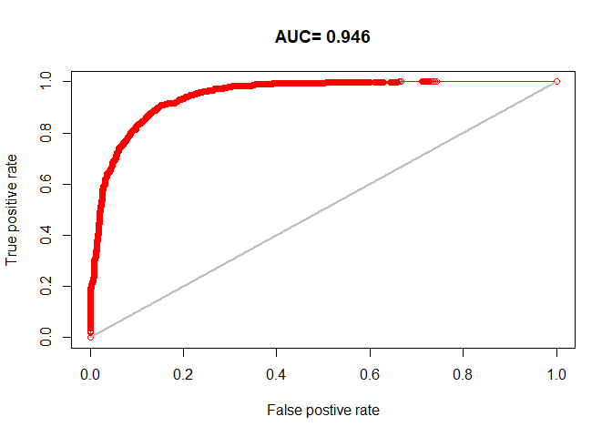

# Random forest models


## Introduction

Random forest models…

https://rspatial.org/analysis/5-global_regression.html

``` r
#Select a season or comment out line 20
seasons <- c('earlywinter', 'latewinter', 'summer', 'fallrut')
nsize = 10000
landcov <- rast('../../data/raster30/landcov.tif')
topo <- rast('../../data/raster30/topo.tif')
fires <- rast('../../data/raster30/fires.tif')
dist2line <- rast('../../data/raster30/dist2line.tif')
names(dist2line) <- "dist2line"
dist2poly <- rast('../../data/raster30/dist2poly.tif')
names(dist2poly) <- "dist2poly"
rasters <- c(landcov, topo, fires, dist2line, dist2poly)
names(rasters)
```

     [1] "forest"    "conifer"   "broadleaf" "mixedwood" "wetland"   "shrubland"
     [7] "grassland" "barren"    "snowice"   "elevation" "slope"     "aspect"   
    [13] "roughness" "northness" "eastness"  "fires"     "dist2line" "dist2poly"

``` r
for (sea in seasons) {
  cat('Processing', sea, '...\n'); flush.console()
  
  # Prepare data
  gps <- st_read('../../data/yt_caribou.gpkg', 'gps_vars') |>
    st_drop_geometry() |>
    filter(season==sea) |>
    mutate(pa=occurrence, fpa=as.factor(occurrence)) |>
    mutate(occurrence=NULL, individual=NULL) |>
    sample_n(nsize) |>
    as.data.frame()

  (covars <- names(gps[,3:19]))

  ################################################################################
  # CART model

  #bio <- rast('../../data/raster1000/bio.tif')
  #cart <- rpart(pa ~ bio1 + bio12, data=gps)
  #printcp(cart)
  #plotcp(cart)
  ##Use the complexity parameter if needed
  ##cart2 <- rpart(pa ~ elevation + roughness + bio1 + bio12, data=gps, cp=0.02)

  # Plot CART model to describe the environmental conditions that are associated with caribou locations
  #rpart.plot(cart, uniform=TRUE, main="Regression Tree")

  # Use the model to show how attractive the climate is for this species.
  #x <- predict(bio, cart)
  #x <- mask(x, bio[[1]])
  #x <- round(x, 2)
  #plot(x, type="class", plg=list(x="bottomleft"))

  ################################################################################
  # Random forest
  
  # Fit the RandomForest model
  i <- sample(nrow(gps), 0.2 * nrow(gps))
  test <- gps[i,]
  train <- gps[-i,]
  crf <- randomForest(train[, covars], train[, "fpa"])
  print(crf)
  png(paste0('../../output/randomforest/',sea,'_varimp.png'))
  varImpPlot(crf)
  dev.off()
  varImpPlot(crf)
  
  # Now we use regression, rather than classification. First we tune a parameter.
  trf <- tuneRF(train[, covars], train[, "pa"])
  print(trf)
  mt <- trf[which.min(trf[,2]), 1]
  print(mt)

  rrf <- randomForest(train[, covars], train[, "pa"], mtry=mt, ntree=250)
  print(rrf)
  png(paste0('../../output/randomforest/',sea,'_rrf.png'))
  plot(rrf)
  dev.off()
  plot(rrf)

  # Predict
  rp <- predict(rasters, rrf, na.rm=TRUE)
  png(paste0('../../output/randomforest/',sea,'_map.png'))
  plot(rp)
  dev.off()
  plot(rp)
  writeRaster(rp, paste0("../../data/predict30/randomforest/",sea,"map.tif"), overwrite=TRUE)

  # Evaluate model
  eva <- pa_evaluate(predict(rrf, test[test$pa==1, ]), predict(rrf, test[test$pa==0, ]))
  png(paste0('../../output/randomforest/',sea,'_auc.png'))
  plot(eva, "ROC")
  dev.off()
  plot(eva, "ROC")
  print(eva)

  # Save mapped predictions
  #writeRaster(rp, paste0('output/random_forests/map_',season,'.tif'))
}
```

    Processing earlywinter ...
    Reading layer `gps_vars' from data source 
      `C:\Users\PIVER37\Desktop\Projects\little_rancheria\data\yt_caribou.gpkg' 
      using driver `GPKG'
    Simple feature collection with 154182 features and 21 fields
    Geometry type: POINT
    Dimension:     XY
    Bounding box:  xmin: 503895 ymin: 466005 xmax: 731595 ymax: 666405
    Projected CRS: NAD83 / Yukon Albers

    Call:
     randomForest(x = train[, covars], y = train[, "fpa"]) 
                   Type of random forest: classification
                         Number of trees: 500
    No. of variables tried at each split: 4

            OOB estimate of  error rate: 14.95%
    Confusion matrix:
         0    1 class.error
    0 3298  686   0.1721888
    1  510 3506   0.1269920

    Warning in randomForest.default(x, y, mtry = mtryStart, ntree = ntreeTry, : The
    response has five or fewer unique values.  Are you sure you want to do
    regression?

    mtry = 5  OOB error = 0.113195 
    Searching left ...

    Warning in randomForest.default(x, y, mtry = mtryCur, ntree = ntreeTry, : The
    response has five or fewer unique values.  Are you sure you want to do
    regression?

    mtry = 3    OOB error = 0.1248237 
    -0.1027316 0.05 
    Searching right ...

    Warning in randomForest.default(x, y, mtry = mtryCur, ntree = ntreeTry, : The
    response has five or fewer unique values.  Are you sure you want to do
    regression?


    mtry = 10   OOB error = 0.1130529 
    0.001255282 0.05 

       mtry  OOBError
    3     3 0.1248237
    5     5 0.1131950
    10   10 0.1130529
    [1] 10

    Warning in randomForest.default(train[, covars], train[, "pa"], mtry = mt, :
    The response has five or fewer unique values.  Are you sure you want to do
    regression?


    Call:
     randomForest(x = train[, covars], y = train[, "pa"], ntree = 250,      mtry = mt) 
                   Type of random forest: regression
                         Number of trees: 250
    No. of variables tried at each split: 10

              Mean of squared residuals: 0.1070173
                        % Var explained: 57.19


    |---------|---------|---------|---------|
    =========================================
                                              


    @stats
       np   na prevalence   auc   cor pcor   ODP
    1 978 1022      0.489 0.923 0.747    0 0.511

    @thresholds
      max_kappa max_spec_sens no_omission equal_prevalence equal_sens_spec
    1     0.588         0.588       0.009            0.489           0.575

    @tr_stats
         treshold kappa  CCR  TPR  TNR  FPR  FNR  PPP  NPP  MCR  OR
    1           0     0 0.49    1    0    1    0 0.49  NaN 0.51 NaN
    2           0  0.03 0.51    1 0.03 0.97    0  0.5    1 0.49 Inf
    3           0  0.03 0.51    1 0.03 0.97    0  0.5    1 0.49 Inf
    4         ...   ...  ...  ...  ...  ...  ...  ...  ...  ... ...
    1776        1  0.03 0.52 0.03    1    0 0.97    1 0.52 0.48 Inf
    1777        1  0.03 0.52 0.03    1    0 0.97    1 0.52 0.48 Inf
    1778        1     0 0.51    0    1    0    1  NaN 0.51 0.49 NaN
    Processing latewinter ...
    Reading layer `gps_vars' from data source 
      `C:\Users\PIVER37\Desktop\Projects\little_rancheria\data\yt_caribou.gpkg' 
      using driver `GPKG'
    Simple feature collection with 154182 features and 21 fields
    Geometry type: POINT
    Dimension:     XY
    Bounding box:  xmin: 503895 ymin: 466005 xmax: 731595 ymax: 666405
    Projected CRS: NAD83 / Yukon Albers

    Call:
     randomForest(x = train[, covars], y = train[, "fpa"]) 
                   Type of random forest: classification
                         Number of trees: 500
    No. of variables tried at each split: 4

            OOB estimate of  error rate: 10.66%
    Confusion matrix:
         0    1 class.error
    0 3394  646  0.15990099
    1  207 3753  0.05227273


    Warning in randomForest.default(x, y, mtry = mtryStart, ntree = ntreeTry, : The
    response has five or fewer unique values.  Are you sure you want to do
    regression?

    mtry = 5  OOB error = 0.08185529 
    Searching left ...

    Warning in randomForest.default(x, y, mtry = mtryCur, ntree = ntreeTry, : The
    response has five or fewer unique values.  Are you sure you want to do
    regression?

    mtry = 3    OOB error = 0.0984977 
    -0.203315 0.05 
    Searching right ...

    Warning in randomForest.default(x, y, mtry = mtryCur, ntree = ntreeTry, : The
    response has five or fewer unique values.  Are you sure you want to do
    regression?

    mtry = 10   OOB error = 0.07753803 
    0.05274255 0.05 

    Warning in randomForest.default(x, y, mtry = mtryCur, ntree = ntreeTry, : The
    response has five or fewer unique values.  Are you sure you want to do
    regression?


    mtry = 17   OOB error = 0.07879516 
    -0.01621307 0.05 

       mtry   OOBError
    3     3 0.09849770
    5     5 0.08185529
    10   10 0.07753803
    17   17 0.07879516
    [1] 10

    Warning in randomForest.default(train[, covars], train[, "pa"], mtry = mt, :
    The response has five or fewer unique values.  Are you sure you want to do
    regression?


    Call:
     randomForest(x = train[, covars], y = train[, "pa"], ntree = 250,      mtry = mt) 
                   Type of random forest: regression
                         Number of trees: 250
    No. of variables tried at each split: 10

              Mean of squared residuals: 0.07487889
                        % Var explained: 70.05


    |---------|---------|---------|---------|
    =========================================
                                              


    @stats
        np  na prevalence   auc   cor pcor   ODP
    1 1007 993      0.503 0.972 0.863    0 0.496

    @thresholds
      max_kappa max_spec_sens no_omission equal_prevalence equal_sens_spec
    1     0.489         0.489       0.009            0.505           0.581

    @tr_stats
         treshold kappa  CCR  TPR  TNR  FPR  FNR  PPP  NPP  MCR    OR
    1           0     0  0.5    1    0    1    0  0.5  NaN  0.5   NaN
    2           0  0.17 0.59    1 0.17 0.83    0 0.55    1 0.41   Inf
    3           0  0.17 0.59    1 0.17 0.83    0 0.55    1 0.41   Inf
    4         ...   ...  ...  ...  ...  ...  ...  ...  ...  ...   ...
    1516        1  0.05 0.52 0.05    1    0 0.95 0.98 0.51 0.48 52.92
    1517        1  0.05 0.52 0.05    1    0 0.95 0.98 0.51 0.48 52.92
    1518        1     0  0.5    0    1    0    1  NaN  0.5  0.5   NaN
    Processing summer ...
    Reading layer `gps_vars' from data source 
      `C:\Users\PIVER37\Desktop\Projects\little_rancheria\data\yt_caribou.gpkg' 
      using driver `GPKG'
    Simple feature collection with 154182 features and 21 fields
    Geometry type: POINT
    Dimension:     XY
    Bounding box:  xmin: 503895 ymin: 466005 xmax: 731595 ymax: 666405
    Projected CRS: NAD83 / Yukon Albers

    Call:
     randomForest(x = train[, covars], y = train[, "fpa"]) 
                   Type of random forest: classification
                         Number of trees: 500
    No. of variables tried at each split: 4

            OOB estimate of  error rate: 13%
    Confusion matrix:
         0    1 class.error
    0 3250  758  0.18912176
    1  282 3710  0.07064128


    Warning in randomForest.default(x, y, mtry = mtryStart, ntree = ntreeTry, : The
    response has five or fewer unique values.  Are you sure you want to do
    regression?

    mtry = 5  OOB error = 0.09923568 
    Searching left ...

    Warning in randomForest.default(x, y, mtry = mtryCur, ntree = ntreeTry, : The
    response has five or fewer unique values.  Are you sure you want to do
    regression?

    mtry = 3    OOB error = 0.1051516 
    -0.05961497 0.05 
    Searching right ...

    Warning in randomForest.default(x, y, mtry = mtryCur, ntree = ntreeTry, : The
    response has five or fewer unique values.  Are you sure you want to do
    regression?


    mtry = 10   OOB error = 0.09690843 
    0.02345175 0.05 

       mtry   OOBError
    3     3 0.10515161
    5     5 0.09923568
    10   10 0.09690843
    [1] 10

    Warning in randomForest.default(train[, covars], train[, "pa"], mtry = mt, :
    The response has five or fewer unique values.  Are you sure you want to do
    regression?


    Call:
     randomForest(x = train[, covars], y = train[, "pa"], ntree = 250,      mtry = mt) 
                   Type of random forest: regression
                         Number of trees: 250
    No. of variables tried at each split: 10

              Mean of squared residuals: 0.09310488
                        % Var explained: 62.76


    |---------|---------|---------|---------|
    =========================================
                                              


    @stats
        np  na prevalence   auc   cor pcor   ODP
    1 1029 971      0.514 0.946 0.801    0 0.486

    @thresholds
      max_kappa max_spec_sens no_omission equal_prevalence equal_sens_spec
    1     0.529         0.529       0.005            0.514           0.612

    @tr_stats
         treshold kappa  CCR  TPR  TNR  FPR  FNR  PPP  NPP  MCR  OR
    1           0     0 0.51    1    0    1    0 0.51  NaN 0.49 NaN
    2           0  0.26 0.64    1 0.26 0.74    0 0.59    1 0.36 Inf
    3           0  0.27 0.64    1 0.26 0.74    0 0.59    1 0.36 Inf
    4         ...   ...  ...  ...  ...  ...  ...  ...  ...  ... ...
    1535        1  0.02  0.5 0.02    1    0 0.98    1 0.49  0.5 Inf
    1536        1  0.02  0.5 0.02    1    0 0.98    1 0.49  0.5 Inf
    1537        1     0 0.49    0    1    0    1  NaN 0.49 0.51 NaN
    Processing fallrut ...
    Reading layer `gps_vars' from data source 
      `C:\Users\PIVER37\Desktop\Projects\little_rancheria\data\yt_caribou.gpkg' 
      using driver `GPKG'
    Simple feature collection with 154182 features and 21 fields
    Geometry type: POINT
    Dimension:     XY
    Bounding box:  xmin: 503895 ymin: 466005 xmax: 731595 ymax: 666405
    Projected CRS: NAD83 / Yukon Albers

    Call:
     randomForest(x = train[, covars], y = train[, "fpa"]) 
                   Type of random forest: classification
                         Number of trees: 500
    No. of variables tried at each split: 4

            OOB estimate of  error rate: 12.55%
    Confusion matrix:
         0    1 class.error
    0 3400  609  0.15190821
    1  395 3596  0.09897269



    Warning in randomForest.default(x, y, mtry = mtryStart, ntree = ntreeTry, : The
    response has five or fewer unique values.  Are you sure you want to do
    regression?

    mtry = 5  OOB error = 0.08961222 
    Searching left ...

    Warning in randomForest.default(x, y, mtry = mtryCur, ntree = ntreeTry, : The
    response has five or fewer unique values.  Are you sure you want to do
    regression?

    mtry = 3    OOB error = 0.1041064 
    -0.1617432 0.05 
    Searching right ...

    Warning in randomForest.default(x, y, mtry = mtryCur, ntree = ntreeTry, : The
    response has five or fewer unique values.  Are you sure you want to do
    regression?


    mtry = 10   OOB error = 0.0878527 
    0.01963478 0.05 

       mtry   OOBError
    3     3 0.10410639
    5     5 0.08961222
    10   10 0.08785270
    [1] 10

    Warning in randomForest.default(train[, covars], train[, "pa"], mtry = mt, :
    The response has five or fewer unique values.  Are you sure you want to do
    regression?


    Call:
     randomForest(x = train[, covars], y = train[, "pa"], ntree = 250,      mtry = mt) 
                   Type of random forest: regression
                         Number of trees: 250
    No. of variables tried at each split: 10

              Mean of squared residuals: 0.08396086
                        % Var explained: 66.42


    |---------|---------|---------|---------|
    =========================================
                                              


    @stats
        np  na prevalence   auc   cor pcor   ODP
    1 1045 955      0.522 0.949 0.813    0 0.478

    @thresholds
      max_kappa max_spec_sens no_omission equal_prevalence equal_sens_spec
    1     0.434         0.434       0.012            0.522           0.558

    @tr_stats
         treshold kappa  CCR  TPR  TNR  FPR  FNR  PPP  NPP  MCR  OR
    1           0     0 0.52    1    0    1    0 0.52  NaN 0.48 NaN
    2           0  0.04 0.54    1 0.04 0.96    0 0.53    1 0.46 Inf
    3           0  0.04 0.54    1 0.04 0.96    0 0.53    1 0.46 Inf
    4         ...   ...  ...  ...  ...  ...  ...  ...  ...  ... ...
    1695        1  0.04  0.5 0.04    1    0 0.96    1 0.49  0.5 Inf
    1696        1  0.04  0.5 0.04    1    0 0.96    1 0.49  0.5 Inf
    1697        1     0 0.48    0    1    0    1  NaN 0.48 0.52 NaN
