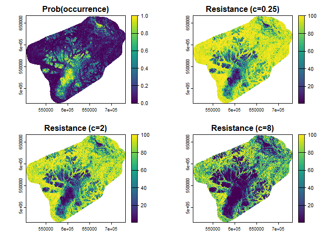

# 5. Resistance surface


``` r
library(sf)
library(terra)
library(tidyverse)
```

## Transformation

We transformed the habitat suitability model with a negative exponential
function using three different c scaling parameter values that allow
more low- and medium- quality pixels to be classified as low resistance
and easier to cross and may more accurately reflect the movements of a
habitat generalist (Poor et al. 2024). The negative exponential function
is:

> 100 - 99 \* ((1 - exp(-c\*h)) / (1- exp(-c)))

where h was the habitat suitability value (range = 0-100), and c was set
to 0.25, 2, and 8, based on recommendations in Keeley et al. (2016).
c=0.25 is an approximate negative linear transformation of suitability,
meaning resistance decreases at a constant rate as the suitability
increases, while 2 and 8 are two increasingly nonlinear transformations.
Higher c values reduce the resistance of less suitable values,
approximating the use of moderate-quality habitat by dispersers.

``` r
# negative exponential function
negex <- function(c, h) {
  x <- 100 - 99 * ((1 - exp(-c*h)) / (1- exp(-c)))
}
```

## Early winter

``` r
r <- rast("../../data/predict30/randomforest/earlywintermap.tif")
rs.25 <- negex(c=0.25, h=r)
writeRaster(rs.25, "../../data/resistance30/earlywinter.25.tif", overwrite=T)
rs.25_agg <- aggregate(rs.25, 10)
writeRaster(rs.25_agg, "../../data/resistance300/earlywinter.25.tif", overwrite=T)
rs2 <- negex(c=2, h=r)
writeRaster(rs2, "../../data/resistance30/earlywinter2.tif", overwrite=T)
rs2_agg <- aggregate(rs2, 10)
writeRaster(rs2_agg, "../../data/resistance300/earlywinter2.tif", overwrite=T)
rs8 <- negex(c=8, h=r)
writeRaster(rs8, "../../data/resistance30/earlywinter8.tif", overwrite=T)
rs8_agg <- aggregate(rs8, 10)
writeRaster(rs8_agg, "../../data/resistance300/earlywinter8.tif", overwrite=T)
par(mfrow=c(2,2))
plot(r, main="Prob(occurrence)")
plot(rs.25, main="Resistance (c=0.25)")
plot(rs2, main="Resistance (c=2)")
plot(rs8, main="Resistance (c=8)")
```


``` r
par(mfrow=c(1,1))
```

## Late winter

``` r
r <- rast("../../data/predict30/randomforest/latewintermap.tif")
rs.25 <- negex(c=0.25, h=r)
writeRaster(rs.25, "../../data/resistance30/latewinter.25.tif", overwrite=T)
rs.25_agg <- aggregate(rs.25, 10)
writeRaster(rs.25_agg, "../../data/resistance300/latewinter.25.tif", overwrite=T)
rs2 <- negex(c=2, h=r)
writeRaster(rs2, "../../data/resistance30/latewinter2.tif", overwrite=T)
rs2_agg <- aggregate(rs2, 10)
writeRaster(rs2_agg, "../../data/resistance300/latewinter2.tif", overwrite=T)
rs8 <- negex(c=8, h=r)
writeRaster(rs8, "../../data/resistance30/latewinter8.tif", overwrite=T)
rs8_agg <- aggregate(rs8, 10)
writeRaster(rs8_agg, "../../data/resistance300/latewinter8.tif", overwrite=T)
par(mfrow=c(2,2))
plot(r, main="Prob(occurrence)")
plot(rs.25, main="Resistance (c=0.25)")
plot(rs2, main="Resistance (c=2)")
plot(rs8, main="Resistance (c=8)")
```


``` r
par(mfrow=c(1,1))
```

## Summer

``` r
r <- rast("../../data/predict30/randomforest/summermap.tif")
rs.25 <- negex(c=0.25, h=r)
rs.25 <- negex(c=0.25, h=r)
writeRaster(rs.25, "../../data/resistance30/summer.25.tif", overwrite=T)
rs.25_agg <- aggregate(rs.25, 10)
writeRaster(rs.25_agg,"../../data/resistance300/summer.25.tif", overwrite=T)
rs2 <- negex(c=2, h=r)
writeRaster(rs2, "../../data/resistance30/summer2.tif", overwrite=T)
rs2_agg <- aggregate(rs2, 10)
writeRaster(rs2_agg, "../../data/resistance300/summer2.tif", overwrite=T)
rs8 <- negex(c=8, h=r)
writeRaster(rs8, "../../data/resistance30/summer8.tif", overwrite=T)
rs8_agg <- aggregate(rs8, 10)
writeRaster(rs8_agg, "../../data/resistance300/summer8.tif", overwrite=T)
par(mfrow=c(2,2))
plot(r, main="Prob(occurrence)")
plot(rs.25, main="Resistance (c=0.25)")
plot(rs2, main="Resistance (c=2)")
plot(rs8, main="Resistance (c=8)")
```


``` r
par(mfrow=c(1,1))
```

## Fall rut

``` r
r <- rast("../../data/predict30/randomforest/fallrutmap.tif")
rs.25 <- negex(c=0.25, h=r)
rs.25 <- negex(c=0.25, h=r)
writeRaster(rs.25, "../../data/resistance30/fallrut.25.tif", overwrite=T)
rs.25_agg <- aggregate(rs.25, 10)
writeRaster(rs.25_agg,"../../data/resistance300/fallrut.25.tif", overwrite=T)
rs2 <- negex(c=2, h=r)
writeRaster(rs2, "../../data/resistance30/fallrut2.tif", overwrite=T)
rs2_agg <- aggregate(rs2, 10)
writeRaster(rs2_agg, "../../data/resistance300/fallrut2.tif", overwrite=T)
rs8 <- negex(c=8, h=r)
writeRaster(rs8, "../../data/resistance30/fallrut8.tif", overwrite=T)
rs8_agg <- aggregate(rs8, 10)
writeRaster(rs8_agg, "../../data/resistance300/fallrut8.tif", overwrite=T)
par(mfrow=c(2,2))
plot(r, main="Prob(occurrence)")
plot(rs.25, main="Resistance (c=0.25)")
plot(rs2, main="Resistance (c=2)")
plot(rs8, main="Resistance (c=8)")
```



``` r
par(mfrow=c(1,1))
```
