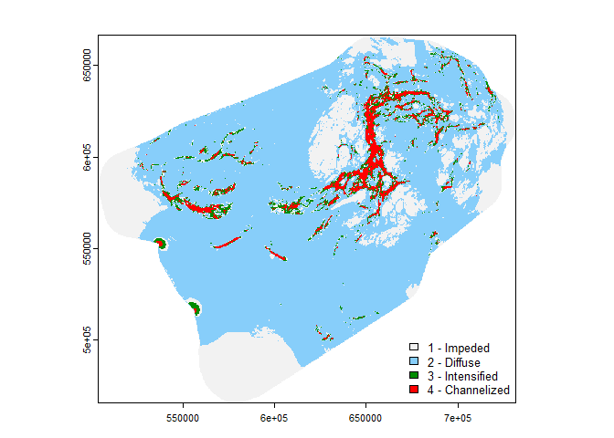

# 6. Omniscape


``` r
library(sf)
library(terra)
library(tidyverse)
library(rpart)
library(rpart.plot)
library(predicts)
library(randomForest)
set.seed(123)
```

# Cumulative current flow

The cumulative current flow map measures the total current flowing
through the landscape and can be interpreted as representing forest
connectivity. Higher values indicate higher connectivity. In the map
below, proposed IPCAs are indicated by transparent blue polygons.

## Early winter

<div class="panel-tabset">

## c = 0.25


## c = 2


## c = 8


</div>

## Late winter

<div class="panel-tabset">

## c = 0.25


## c = 2


## c = 8


</div>

## Summer

<div class="panel-tabset">

## c = 0.25


## c = 2


## c = 8


</div>

## Fall rut

<div class="panel-tabset">

## c = 0.25


## c = 2


## c = 8


</div>

# Flow potential

The flow potential map shows what connectivity looks like under “null”
conditions (i.e., resistance equals 1 for the whole landscape). In other
words, flow potential shows what connectivity would look like in the
absence of barriers to movement. In the map below, proposed IPCAs are
indicated by transparent blue polygons.

## Early winter

<div class="panel-tabset">

## c = 0.25


## c = 2


## c = 8


</div>

## Late winter

<div class="panel-tabset">

## c = 0.25


## c = 2


## c = 8


</div>

## Summer

<div class="panel-tabset">

## c = 0.25


## c = 2


## c = 8


</div>

## Fall rut

<div class="panel-tabset">

## c = 0.25


## c = 2


## c = 8


</div>

# Nomalized current flow

The normalized (cumulative) current flow is calculated as flow potential
divided by cumulative current. Values greater than one indicate areas
with channelized/bottlenecked flow. Values around 1 (cumulative current
~ flow potential) indicate diffuse current. Values less than 1 indicate
impeded flow. In the map below, proposed IPCAs are indicated by
transparent blue polygons.

## Early winter

<div class="panel-tabset">

## c = 0.25


## c = 2


## c = 8


</div>

## Late winter

<div class="panel-tabset">

## c = 0.25


## c = 2


## c = 8


</div>

## Summer

<div class="panel-tabset">

## c = 0.25


## c = 2


## c = 8


</div>

## Fall rut

<div class="panel-tabset">

## c = 0.25


## c = 2


## c = 8


</div>

# Connectivity categories

1.  Impeded (0 - 0.7)
2.  Diffuse (0.7 - 1.3)
3.  Intensified (1.3 - 1.7)
4.  Channelized (1.7 - 9999)

``` r
m <- c(0, 0.7, 1,
       0.7, 1.3, 2,
       1.4, 1.7, 3,
       1.7, 9999, 4)
rclmat <- matrix(m, ncol=3, byrow=TRUE)
# Early winter
m4s1c1 = as.factor(classify(m3s1c1, rclmat, include.lowest=TRUE))
m4s1c2 = as.factor(classify(m3s1c2, rclmat, include.lowest=TRUE))
m4s1c3 = as.factor(classify(m3s1c3, rclmat, include.lowest=TRUE))
# Late winter
m4s2c1 = as.factor(classify(m3s2c1, rclmat, include.lowest=TRUE))
m4s2c2 = as.factor(classify(m3s2c2, rclmat, include.lowest=TRUE))
m4s2c3 = as.factor(classify(m3s2c3, rclmat, include.lowest=TRUE))
# Summer
m4s3c1 = as.factor(classify(m3s3c1, rclmat, include.lowest=TRUE))
m4s3c2 = as.factor(classify(m3s3c2, rclmat, include.lowest=TRUE))
m4s3c3 = as.factor(classify(m3s3c3, rclmat, include.lowest=TRUE))
# Fall rut
m4s4c1 = as.factor(classify(m3s4c1, rclmat, include.lowest=TRUE))
m4s4c2 = as.factor(classify(m3s4c2, rclmat, include.lowest=TRUE))
m4s4c3 = as.factor(classify(m3s4c3, rclmat, include.lowest=TRUE))
```

## Early winter

<div class="panel-tabset">

## c = 0.25


## c = 2


## c = 8


</div>

## Late winter

<div class="panel-tabset">

## c = 0.25



## c = 2


## c = 8


</div>

## Summer

<div class="panel-tabset">

## c = 0.25


## c = 2


## c = 8


</div>

## Fall rut

<div class="panel-tabset">

## c = 0.25


## c = 2


## c = 8


</div>
