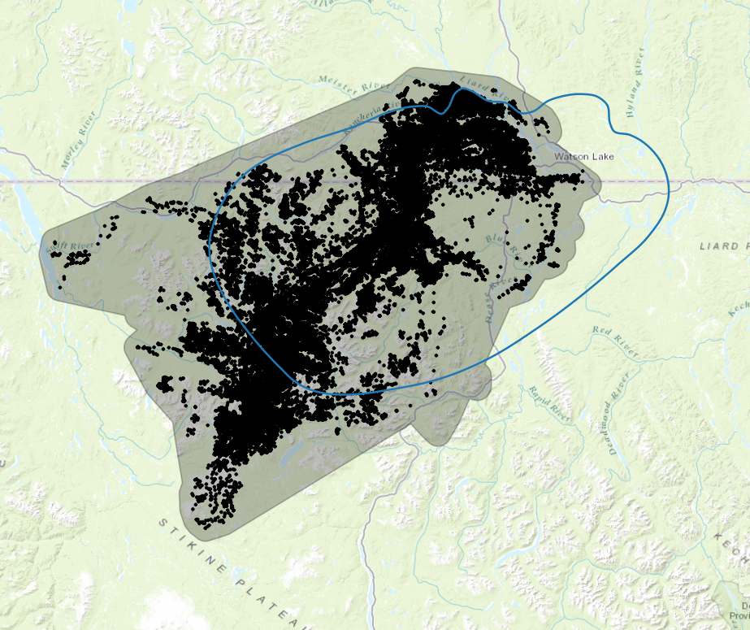
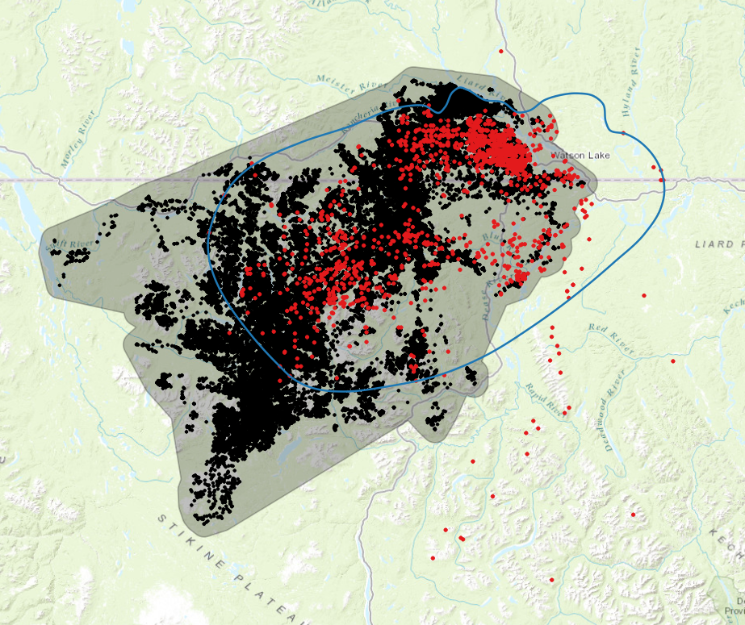

# Little Rancheria Caribou Herd: Analysis of Movement, Habitat, and
Connectivity

Revised: Oct 21, 2024

## Introduction

The objective of this project is to analyse movement patterns, habitat
use, and functional connectivity of caribou in the Little Rancheria
region of BC and Yukon. Products will include i) a detailed report
describing methods, ii) a set of maps identifying seasonal ranges and
movement corridors, and iii) an app allowing users to explore the
results of the analyses. This is a draft document that will be revised
as necessary based on feedback from collaborators.

## Tasks and timelines

Table 1. Preliminary tasks and timelines organized into five components.

| **Component** | **Task** | **Timeline** |
|----|----|----|
| Data preparation | Acquire caribou telemetry data and prepare for analysis |  |
|  | Generate pseudo-absence or availability data for analysis region |  |
|  | Acquire landscape and bioclimate covariate data and prepare for analysis | July 31 |
| Movement analysis | Create telemetry objects and visualize movement patterns |  |
|  | Fit and validate movement models for individual caribou |  |
|  | Estimate home ranges for caribou population and individual caribou | Aug 30 |
| Habitat analysis | Develop and test habitat models using current landscape conditions |  |
|  | Develop and test habitat models using bioclimatic covariates |  |
|  | Use models to identify (seasonal) habitat ranges and changes over time | Oct 15 |
| Connectivity analysis | Create permeability/resistance surfaces using habitat models |  |
|  | Conduct connectivity analysis and metric calculation using Omniscape |  |
|  | Identify current and potential future movement corridors | Nov 30 |
| Caribou explorer app | Develop prototype app for exploring results of analyses |  |
|  | Test app and obtain feedback from collaborators and other users |  |
|  | Revise and test app based on feedback | Dec 31 |

## Caribou locations

We acquired two telemetry datasets for the Little Rancheria analysis
region, one from the Yukon government (Table 2) and the other from the
BC government (Table 3). The datasets overlap in space and time with
many locations in common (Figure 1). Appendices 1 and 2 provide
additional details for collared caribou.

  Figure 1.
Distribution of caribou locations obtained from Yukon government (left)
and BC government (right). Caribou with a collar id are shown in red.
The grey polygon represents the 100% MCP + 5km buffer for all collared
caribou with at least 5 locations.

 Table 2. YT dataset. Number of caribou locations, collars, and
mortality by year.

| **Year** | **Locations** | **Collars** | **Mortality** |
|----------|---------------|-------------|---------------|
| 2024     | 4,423         | 15          | 0             |
| 2023     | 21,915        | 15          | 0             |
| 2022     | 25,486        | 22          | 12            |
| 2021     | 33,390        | 25          | 0             |
| 2020     | 5,650         | 25          | 0             |

 Table 3. BC dataset. Number of caribou locations, collars, and
mortality by year.

| **Year** | **Locations** | **Collars** | **Mortality** |
|----------|---------------|-------------|---------------|
| 2023     | 27,694        | 28          | 0             |
| 2022     | 42,187        | 36          | 0             |
| 2021     | 36,210        | 28          | 0             |
| 2020     | 5,658         | 29          | 0             |
| 2019     | 348           | 5           | 0             |
| 2018     | 786           | 14          | 2             |
| ~        | ~             | ~           | ~             |
| 2001     | 85            | 0           | 0             |
| 2000     | 189           | 0           | 0             |
| 1999     | 254           | 0           | 0             |
| 1998     | 328           | 0           | 0             |
| 1997     | 523           | 0           | 0             |
| 1996     | 54            | 0           | 0             |

## Appendix 1. YT dataset

Summary statistics for individual caribou with an Identity value i.e., a
collar.

| **Identity** | **Start** | **End** | **Interval (hours)** | **Duration (years)** | **Points** |
|----|----|----|----|----|----|
| 43140 | 11/5/2020 1:14 | 3/13/2024 9:23 | 5.98 | 3.35 | 4891 |
| 43141 | 11/4/2020 1:18 | 3/14/2024 15:18 | 5.98 | 3.36 | 4902 |
| 43142 | 11/6/2020 1:10 | 3/14/2024 15:18 | 5.98 | 3.35 | 4875 |
| 43143 | 11/4/2020 19:15 | 3/14/2024 21:17 | 5.98 | 3.36 | 4911 |
| 43144 | 11/4/2020 1:18 | 3/14/2024 9:19 | 5.98 | 3.36 | 4909 |
| 43145 | 11/4/2020 19:15 | 3/14/2024 9:19 | 5.98 | 3.36 | 4905 |
| 43146 | 11/3/2020 19:19 | 3/14/2024 3:21 | 5.98 | 3.36 | 4899 |
| 43147 | 11/3/2020 19:19 | 4/20/2022 1:44 | 5.98 | 1.46 | 2127 |
| 43148 | 11/5/2020 19:12 | 8/9/2022 0:19 | 5.98 | 1.76 | 2563 |
| 43149 | 11/6/2020 1:10 | 7/25/2022 1:19 | 5.98 | 1.71 | 2497 |
| 43150 | 11/4/2020 1:19 | 4/28/2021 1:36 | 5.98 | 0.48 | 694 |
| 43151 | 11/5/2020 19:14 | 2/6/2022 6:36 | 5.98 | 1.25 | 1824 |
| 43152 | 11/5/2020 1:15 | 3/14/2024 21:17 | 5.98 | 3.36 | 4908 |
| 43153 | 11/6/2020 1:11 | 3/14/2024 9:19 | 5.98 | 3.35 | 4897 |
| 43154 | 11/4/2020 19:15 | 3/14/2024 9:19 | 5.98 | 3.36 | 4903 |
| 43155 | 11/5/2020 1:14 | 7/9/2021 14:46 | 5.98 | 0.68 | 977 |
| 43156 | 11/5/2020 1:14 | 2/25/2021 5:44 | 5.98 | 0.31 | 446 |
| 43157 | 11/6/2020 19:07 | 3/14/2024 9:19 | 5.98 | 3.35 | 4891 |
| 43158 | 11/4/2020 1:18 | 5/23/2022 5:31 | 5.98 | 1.55 | 2260 |
| 43159 | 11/4/2020 1:18 | 3/14/2024 21:17 | 5.98 | 3.36 | 4905 |
| 43160 | 11/5/2020 1:14 | 3/14/2024 9:19 | 5.98 | 3.35 | 4896 |
| 43161 | 11/3/2020 19:19 | 4/11/2022 8:22 | 5.98 | 1.43 | 1760 |
| 43162 | 11/6/2020 1:11 | 5/20/2022 5:43 | 5.98 | 1.53 | 2231 |
| 43163 | 11/6/2020 19:10 | 3/14/2024 3:20 | 5.98 | 3.35 | 4893 |
| 43164 | 11/4/2020 1:18 | 3/14/2024 9:19 | 5.98 | 3.36 | 4900 |

## Appendix 2. BC dataset

Summary statistics for individual caribou with an Identity value i.e., a
collar. Statistics for uncollared caribou (Identity = “NA”) are lumped
together.

| **Identity** | **Start** | **End** | **Interval (hours)** | **Duration (years)** | **Points** |
|----|----|----|----|----|----|
| 43140 | 11/6/2020 1:10 | 12/24/2023 20:42 | 5.98 | 3.13 | 4508 |
| 43141 | 11/5/2020 1:14 | 12/24/2023 20:42 | 5.98 | 3.13 | 4510 |
| 43142 | 11/7/2020 1:06 | 10/19/2023 1:12 | 5.98 | 2.95 | 4242 |
| 43143 | 11/6/2020 1:10 | 10/19/2023 7:09 | 5.98 | 2.95 | 4229 |
| 43144 | 11/5/2020 1:14 | 10/18/2023 19:11 | 5.98 | 2.95 | 4281 |
| 43145 | 11/6/2020 1:10 | 12/24/2023 20:43 | 5.98 | 3.13 | 4505 |
| 43146 | 11/5/2020 1:15 | 12/24/2023 20:42 | 5.98 | 3.13 | 4493 |
| 43147 | 11/5/2020 1:14 | 12/13/2022 9:52 | 5.98 | 2.1 | 3117 |
| 43148 | 11/5/2020 19:12 | 12/11/2022 4:01 | 5.98 | 2.1 | 3071 |
| 43149 | 11/7/2020 1:06 | 12/13/2022 9:52 | 5.98 | 2.1 | 3056 |
| 43150 | 11/5/2020 1:14 | 12/13/2022 3:53 | 5.98 | 2.1 | 3091 |
| 43151 | 11/7/2020 1:06 | 12/12/2022 21:54 | 5.98 | 2.1 | 3126 |
| 43152 | 11/6/2020 1:10 | 12/24/2023 20:42 | 5.98 | 3.13 | 4507 |
| 43154 | 11/6/2020 1:10 | 10/18/2023 19:11 | 5.98 | 2.95 | 4279 |
| 43155 | 11/6/2020 1:10 | 12/12/2022 21:54 | 5.98 | 2.1 | 3086 |
| 43156 | 11/6/2020 1:10 | 12/13/2022 9:52 | 5.98 | 2.1 | 3089 |
| 43157 | 11/8/2020 1:02 | 12/24/2023 20:42 | 5.98 | 3.13 | 4504 |
| 43158 | 11/5/2020 1:14 | 12/12/2022 21:54 | 5.98 | 2.1 | 2651 |
| 43159 | 11/5/2020 1:15 | 10/19/2023 7:09 | 5.98 | 2.95 | 4274 |
| 43160 | 11/6/2020 1:10 | 12/24/2023 20:42 | 5.98 | 3.13 | 4513 |
| 43161 | 11/5/2020 1:14 | 12/12/2022 15:55 | 5.98 | 2.1 | 2706 |
| 43162 | 11/7/2020 1:06 | 12/11/2022 4:01 | 5.98 | 2.09 | 3067 |
| 43163 | 11/8/2020 1:02 | 12/24/2023 20:42 | 5.98 | 3.13 | 4486 |
| 43164 | 11/5/2020 1:14 | 12/24/2023 20:42 | 5.98 | 3.13 | 4517 |
| 48401 | 3/17/2022 8:00 | 10/18/2023 20:00 | 4 | 1.59 | 1612 |
| 48407 | 3/17/2022 8:00 | 10/17/2023 20:00 | 4 | 1.59 | 1626 |
| 48412 | 3/16/2022 8:00 | 12/24/2023 20:00 | 4 | 1.78 | 1745 |
| 48836 | 3/17/2022 8:00 | 10/15/2023 20:00 | 4 | 1.58 | 1624 |
| 48837 | 3/16/2022 8:00 | 12/24/2023 20:00 | 4 | 1.78 | 1757 |
| 48838 | 3/16/2022 8:00 | 10/17/2023 20:00 | 4 | 1.59 | 1622 |
| 48840 | 3/15/2022 8:00 | 12/24/2023 20:00 | 4 | 1.78 | 1862 |
| 48841 | 3/16/2022 8:00 | 10/17/2023 20:00 | 4 | 1.59 | 1595 |
| 48846 | 3/17/2022 8:00 | 10/17/2023 20:00 | 4 | 1.59 | 1625 |
| 48847 | 3/15/2022 8:00 | 10/18/2023 8:00 | 4 | 1.59 | 1594 |
| 86360 | 11/8/2020 4:01 | 5/19/2021 11:01 | 13 | 0.53 | 236 |
| 86362 | 11/8/2020 4:01 | 12/24/2023 11:01 | 13 | 3.12 | 1276 |
| 86363 | 11/8/2020 4:00 | 4/15/2021 21:01 | 13 | 0.43 | 213 |
| 86365 | 11/8/2020 4:01 | 12/24/2023 11:00 | 13 | 3.12 | 1387 |
| 101746 | 3/29/2018 13:01 | 6/4/2018 4:00 | 45.49 | 0.18 | 23 |
| 101747 | 3/25/2018 18:01 | 7/9/2018 22:00 | 52.02 | 0.29 | 27 |
| 101752 | 4/1/2018 6:01 | 8/8/2018 17:01 | 19.5 | 0.35 | 49 |
| 101753 | 4/2/2018 21:01 | 9/21/2018 1:00 | 51.98 | 0.47 | 38 |
| 101758 | 3/31/2018 17:01 | 4/1/2019 8:00 | 26.02 | 1 | 118 |
| 101759 | 3/26/2018 7:01 | 5/31/2018 9:00 | 78 | 0.18 | 17 |
| 101761 | 3/26/2018 7:00 | 7/16/2019 12:00 | 25.99 | 1.31 | 195 |
| 101762 | 3/26/2018 7:01 | 9/2/2018 15:00 | 51.99 | 0.44 | 49 |
| 101765 | 3/27/2018 9:00 | 9/1/2019 15:00 | 25.98 | 1.43 | 203 |
| 101766 | 3/30/2018 2:01 | 7/26/2020 23:00 | 38.98 | 2.33 | 267 |
| 101767 | 4/18/2018 14:01 | 4/26/2018 17:00 | 97.49 | 0.02 | 3 |
| 101768 | 4/11/2018 0:01 | 7/3/2018 23:01 | 26 | 0.23 | 44 |
| 101769 | 3/25/2018 5:00 | 12/25/2019 11:01 | 26.02 | 1.75 | 164 |
| 101792 | 4/7/2018 18:01 | 5/13/2018 12:00 | 169 | 0.1 | 4 |
| NA | 10/19/1996 7:00 | 11/23/2001 8:00 | 0 | 5.1 | 1433 |
